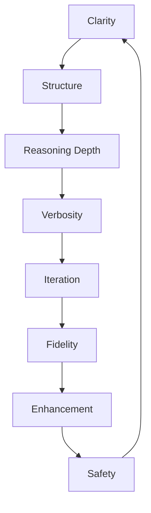

# 📘 GPT-5 Prompting Best Practices Guide (RAG-Ready Master Edition)

*Comprehensive Knowledge Resource for Retrieval-Augmented Generation (RAG)*  
**Version:** C₂$ (Hybrid Optimized, Two-Layer) • **Last Updated:** 2025-08-30

---

# Layer 1: Core RAG Evaluation Guide

## Preface (Core)

GPT-5 prompting is not about “magic words.” It is about **contracts**: clear agreements between human intent and machine reasoning. This core reference provides:
- **Schemas & Checklists** → for fast grading.
- **Best Practices Wheel** → to frame evaluation.
- **Anti-Patterns** → to detect weak prompts.
- **Compact Walkthroughs** → for direct reference.

This layer is intentionally concise, optimized for **RAG lookup and automated evaluation**.

---

## Section 1: Core Why Prompting Matters
- Prevents drift in large 256K token contexts.
- Steers GPT-5’s router between fast vs. deep reasoning.
- Acts as guardrails in high-stakes domains.
- Provides reproducibility for audits.

**Analogy:** GPT-5 is an orchestra. The router is the conductor. The operator is the composer. **The prompt is the score.**

---

## Section 2: Core Best Practices (Prompting Wheel)



**Evaluation Dimensions:**
- **Clarity:** Task clearly defined.
- **Structure:** Output format specified.
- **Depth:** Fast / CoT / ToT / SoT / Hybrid.
- **Verbosity:** Concise vs. elaborate.
- **Iteration:** Chaining (A + B → C).
- **Fidelity:** Syntax preserved.
- **Enhancement:** A$ (single) / C$ (hybrid optimized).
- **Safety:** RAG inputs sanitized.

---

## Section 3: Core Reasoning Frameworks

**CoT (Chain of Thought):** Step-by-step reasoning.
```yaml
reasoning_mode: "CoT"
steps: true
```

**ToT (Tree of Thought):** Branches with evaluation.
```yaml
reasoning_mode: "ToT"
branches: 3
evaluation: pros_cons
```

**SoT (Sketch of Thought):** Quick sketch before final answer.

**Hybrid Reasoning:** Combine frameworks for layered reasoning.

---

## Section 4: Core Anti-Patterns
- ❌ Redundant disclaimers ("Do not hallucinate. Be professional.").
- ❌ Overloaded prompts (contradictory constraints).
- ❌ Vague tasks ("Summarize this").
- ❌ Schema corruption (broken YAML/JSON).

---

## Section 5: Operator’s Core Checklist

```yaml
operator_checklist:
  - goal_defined: true
  - output_format: explicit
  - reasoning_depth: chosen
  - verbosity: controlled
  - contradictions: none
  - fidelity: syntax_preserved
  - enhancement: A$ | C$
  - rag_input: sanitized
```

---

# Layer 2: Extended Appendix (Full Narrative & Case Studies)

This appendix contains **B₂’s richness** — historical context, extended dialogues, long-form case studies, and speculative roadmaps. It supplements the core reference with depth for **human operators and advanced GPT reasoning**.

---

## Preface (Extended)

The story of prompting spans decades of human-machine interaction: from terminals to search engines, to GPT-3’s autocomplete, GPT-4’s fragile scaffolds, and now GPT-5’s contract-based reasoning.  

GPT-5 prompts are **not about tricking** the model, but about **setting scope, defining standards, and clarifying form.**

---

## Extended Case Studies & Walkthroughs

### 1. Research (Climate Migration)
Full dialogue with operator refinement → vague → structured → numeric table → C$ refinement with IPCC context.

### 2. Creative Writing (Fantasy World)
Layered Markdown → Mermaid faction map → narrative expansion.

### 3. Coding (Multiplayer Game)
Socket pseudocode → YAML configs → PHPUnit tests.

### 4. Policy (Autonomous Vehicles)
Draft → structured sections → personas debate → EU compliance alignment.

### 5. Corporate Strategy (Southeast Asia Expansion)
Initial generic → structured Markdown → risks/forecast tables.

---

## Extended Techniques
- Progressive Hinting (dialogue scaffolding).
- Persona Injection (regulator, CEO, activist).
- Ambiguity Detection (spot contradictions).
- Self-Evaluation (model critiques itself).
- Alternatives Mode (multi-style outputs).
- Meta-Prompting (prompt refinement by GPT itself).

---

## Forward-Looking Roadmap (Extended)

### Promptcraft as Governance
Prompts as compliance artifacts → schema validation → logging → audit → regulatory compliance.

### Multi-Agent Orchestration
Prompts as orchestration contracts across Research, Creative, and Critic agents.

### GPT-6 Speculation
Prompts shift from natural language to **schema-native YAML contracts**.

### Operator Roles
- Designer (structures contracts)
- Critic (reviews outputs)
- Coach (iterates until fit)
- Archivist (logs prompts & outputs)

---

## Closing Reflection

Promptcraft is **not dying**. It is **professionalizing**.  
- **Core Layer:** RAG-ready → fast evaluation.  
- **Appendix Layer:** Narrative-rich → deep operator training.  

Together, they ensure GPT-5 can **evaluate prompts without external search**, while operators still have a **field manual** for learning and context.

