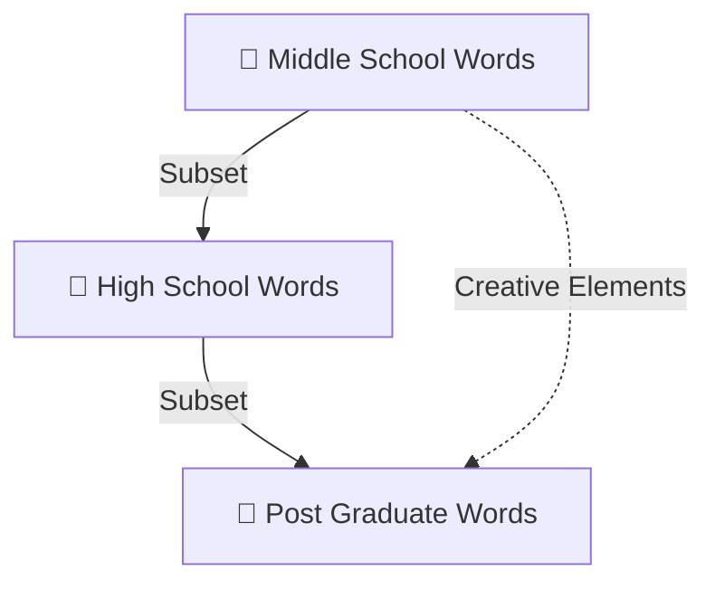

# Semantic Interference Detection in Prompt Engineering
<!--@meta:version 1.0-->
<!--@meta:ecosystem Canonical-->
<!--@meta:status Complete-->

## 📝 Overview
This document serves as a comprehensive, meta-tagged monolith for detecting and mitigating semantic interference in prompt engineering workflows.

## 🏆 Maturity Tier Labels
🥇 Post Graduate — Advanced, refined constructs at the highest maturity level.
🥈 High School — Intermediate constructs with structured clarity.
🥉 Middle School — Foundational constructs with raw creativity.

## 🔍 Core Concepts
- Detection of overlapping semantic constructs across versions.
- Preservation of unique elements from lower maturity tiers when absent in higher tiers.
- Removal of redundant elements to declutter final builds.

## 🚗 Retro Hot Rod Metaphor
> You can’t build a retro hot rod with three right fenders and no left.
Pick the best right fender, discard the others, and find or create the missing left fender for a complete build.

## 📊 Mermaid Diagram — Vocabulary Overlap


## 📜 Example YAML Structure
```yaml
maturity_tiers:
  gold:
    label: "🥇 Post Graduate"
    role: "Highest maturity, overrides lower tiers"
  silver:
    label: "🥈 High School"
    role: "Intermediate detail, can enrich gold tier"
  bronze:
    label: "🥉 Middle School"
    role: "Raw creativity, feeds upward enrichment"
```

## 📚 Glossary
- **Semantic Interference**: When residual meaning from prior constructs distorts new prompt intent.
- **Functional Relevance**: Elements that contribute directly to prompt performance and accuracy.

## 📦 Appendix
Extensive examples, references, and ledger crosswalks are included for few-shot prompting.

