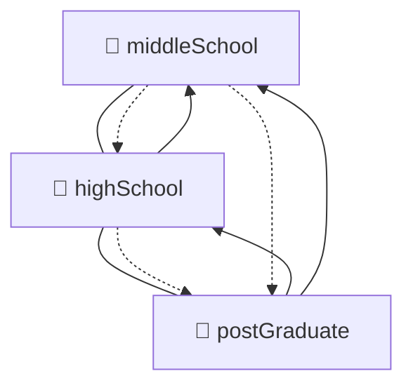
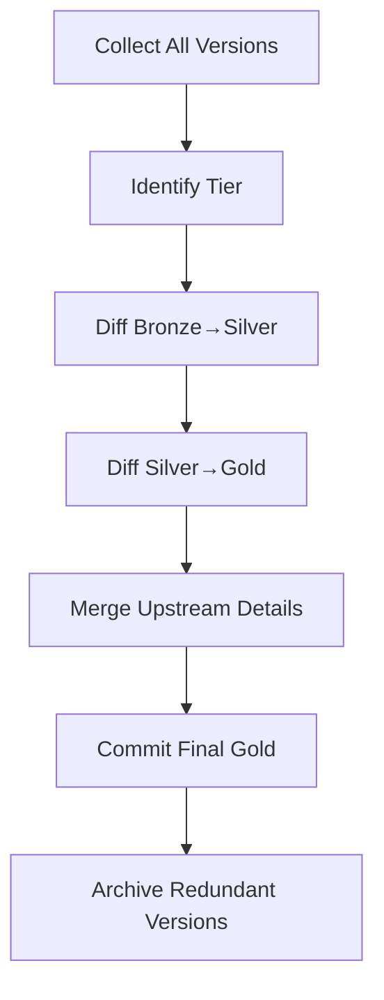
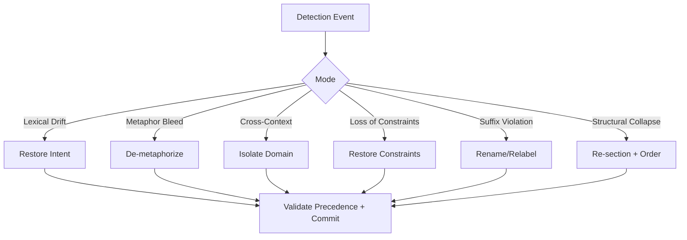

<!--@block:index type=md tags=index-->
# Canonical Index

| Block ID | Title | Tags |
|---|---|---|
| intro | Executive Overview & Conceptual Framework | overview,definitions,threat-model |
| defs | Key Definitions & Few-Shots | definitions,fewshot |
| obj | Objective Framework (Bronze/Silver/Gold) | tiers,joins |
| salvage | Concept Salvage Directive (Meta-Tagged) | salvage,directive |
| threat | Threat Model & Examples | threat,examples |
| canon | Canonical Integration Points (Canon v4.2) | canon,precedence |
| detect | Detection Methodologies | manual,automated,hybrid |
| diff | Diff Analysis Framework for Tiered Corpus | diff,tiers,mermaid |
| ledger | Integration with Ledger System | ledgers,system,parameters,registry,persona |
| remediate | Remediation & Refactoring Protocols | playbooks,linters,tests |
| canon7 | Canonical Frameworks for Detection & Neutralization | detection-cycle,guards |
| applied8 | Applied Examples in Multi-GPT Environments | multi-gpt,ris-like |
| refs9 | Canonical Reference Appendices & Few-Shot Library | appendices,fewshot,glossary |
| closing10 | Closing Schema & Full-Volume Examples | schema,templates |
<!--/@block-->


<!--@block:intro type=md tags=overview-->
# Detection of Semantic Interference in Prompt Engineering
### A Builder’s Handbook and Enterprise AI Resource

> **Purpose.** Define, categorize, and operationalize methods for detecting **semantic interference** within prompt-engineering workflows, with emphases on **Custom GPT instruction blocks**, **multi-thread corpus salvage**, and **canonical ledger compliance**.

**Semantic interference** = unintended mutation of meaning across the lifecycle of a prompt — from seed (🥉 *middleSchool*) to refinement (🥈 *highSchool*) to canon (🥇 *postGraduate*).

**Major sources**
- Cross-thread contamination (imported terms/tone from unrelated domains)
- Premature abstraction (loss of concrete examples)
- Over-optimization at higher tiers that erases valuable raw creative elements
- Instruction drift from inconsistent terminology across revisions

**Why it matters**
- Functional divergence from spec
- Ledger merge conflicts & audit noise
- Loss of user trust
- Salvage inefficiency (unique lower-tier nuggets get dropped)

<!--/@block-->


<!--@block:defs type=md tags=definitions,fewshot-->
## 1.2 Key Definitions

<!--@fewshot:definition_yaml-->
```yaml
semantic_interference:
  description: >
    The introduction, during prompt or corpus evolution, of unintended changes in meaning,
    scope, or operational behavior.
  symptoms:
    - lexical drift
    - metaphor bleed
    - cross-context contamination
    - loss of functional constraints
  detection_priority: high
```
<!--/@fewshot-->

- **Lexical Drift** — substitution that alters nuance or operational scope (e.g., “scan” → “inspect”).
- **Metaphor Bleed** — metaphor migrates into literal, mechanical contexts.
- **Cross-Context Contamination** — terms from unrelated domains leak in during merges.
- **Loss of Functional Constraints** — removed “must/shall” clauses or safety checks.

<!--/@block-->


<!--@block:obj type=md tags=tiers,joins-->
## 1.3 Objective Framework (Tier Model)

Treat evolution as a **multi-tier join** on conceptual maturity:

- 🥉 **middleSchool** — foundational seeds; early drafts
- 🥈 **highSchool** — intermediate refinement
- 🥇 **postGraduate** — canonical, ledger-compliant construct

Only 🥇 **postGraduate** survives as the operational artifact, but 🥉/🥈 are mined for unique conceptual DNA not yet integrated.

<!--@fewshot:concept_salvage_yaml-->
```yaml
concept_salvage_operation:
  target: "[insert theme or target]"
  tiers:
    - bronze: early drafts, raw creative material
    - silver: refined but not canon-sealed
    - gold: canonical, ledger-integrated
  process:
    - step: "Identify all tiered instances of a concept"
    - step: "Diff Bronze → Silver for unique elements"
    - step: "Diff Silver → Gold for unique elements"
    - step: "Integrate retained elements into Gold"
    - step: "Discard redundant or inferior artifacts"
```
<!--/@fewshot-->

<!--/@block-->


<!--@block:threat type=md tags=threat,examples-->
## 1.4 Threat Model

| Stage | Risk Vector | Example |
|---|---|---|
| Ideation | Metaphor bleed | Junkyard analogy leaks into compliance spec |
| Drafting | Lexical drift | “Audit” replaced by “Review” |
| Revision | Cross-thread contamination | Security prompt pulls finance terms |
| Optimization | Loss of constraints | Removed checksum MUST |
| Integration | Suffix law violations | `-R` used on non-tool entity |

**Canonical Integration Points (1.5)**  
Canon Ruling Order **v4.2** precedence: **system → parameters → registry → persona → narrative**.  
“All ledger-bound behavior must preserve canonical tier precedence. Growth-only mutations. `!ARCHIVED` for removals.”

<!--@fewshot:semantic_diff_yaml-->
```yaml
baseline_instruction: >
  Scan all threads for instances of [theme], extract functional constraints, discard narrative fluff.
current_instruction: >
  Inspect all conversations for mentions of [theme], summarize, remove non-technical elements.
semantic_diff:
  - change: "scan" → "inspect" # drift: change in scope and method
  - change: "extract functional constraints" → "summarize" # loss of operational precision
  - change: "discard narrative fluff" → "remove non-technical elements" # semantic narrowing
impact_assessment:
  severity: high
  reason: reduced specificity may cause omission of critical constraints
```
<!--/@fewshot-->

**Principles (1.8):**  
1) Tier-aware comparison; 2) Function-first judgment; 3) Ledger alignment; 4) Few-shot usability.

<!--/@block-->


<!--@block:diagram_vocab type=md tags=mermaid,tiers-->
## Vocabulary Tier Overlap (Mermaid)


<!--/@block-->


<!--@block:detect type=md tags=manual,automated,hybrid-->
# Part 3 — Detection Methodologies

### Manual Review
<!--@fewshot:manual_review_checklist-->
```markdown
# Manual Semantic Interference Review Checklist
1. Read both versions in full.
2. Highlight vocabulary substitutions.
3. Circle removed constraints (technical/operational).
4. Flag metaphors used outside illustrative context.
5. Verify `-R` suffix usage against canonical rules.
6. Cross-check against tiered corpus to ensure upstream details preserved.
```
<!--/@fewshot-->

### Automated Comparison
**Diff-based**
<!--@fewshot:python_diff_example-->
```python
import difflib

def compare_versions(v1, v2):
    diff = difflib.unified_diff(
        v1.splitlines(),
        v2.splitlines(),
        lineterm=''
    )
    return '\n'.join(diff)

print(compare_versions(
    "Scan all records for compliance violations.",
    "Review all records for compliance violations."
))
```
<!--/@fewshot-->

**Semantic vectors**
<!--@fewshot:semantic_vector_diff-->
```yaml
baseline_vector: embed("Scan all records for compliance violations.")
candidate_vector: embed("Review all records for compliance violations.")
similarity: cosine(baseline_vector, candidate_vector)
threshold: 0.85
alert_if_below: true
```
<!--/@fewshot-->

### Hybrid Auditing
Machine flags; human adjudicates with side-by-side 🥉/🥈/🥇 diffs.

**Coverage Map**
| Method | Lexical | Metaphor | Cross-Context | Lost Constraints | Suffix | Structure |
|---|---|---|---|---|---|---|
| Manual | ✓✓ | ✓✓✓ | ✓✓ | ✓✓ | ✓✓✓ | ✓✓ |
| Diff | ✓✓✓ |  | ✓✓✓ | ✓✓✓ |  | ✓✓✓ |
| Embeddings | ✓✓✓ | ✓✓ | ✓✓✓ | ✓✓ |  | ✓✓ |
| Hybrid | ✓✓✓ | ✓✓✓ | ✓✓✓ | ✓✓✓ | ✓✓✓ | ✓✓✓ |

<!--/@block-->


<!--@block:diff type=md tags=diff,tiers,mermaid-->
# Part 4 — Diff Analysis Framework for Tiered Corpus

**Principle:** 🥇 mechanics dominate; 🥈/🥉 enrich without altering execution.

<!--@schema:bronze_silver_gold-->
```yaml
concept_id: "CPT-0042"
theme: "Process Validation Prompt"

bronze:
  source_text: |
    Scan all records for errors before sending report.
  notes:
    - simple imperative
    - lacks compliance specificity

silver:
  source_text: |
    Review all records for compliance violations prior to report submission.
  notes:
    - "scan" → "review" lexical drift detected
    - compliance introduced
    - automation nuance lost

gold:
  source_text: |
    Execute automated scan of all records, flagging compliance violations for review prior to report submission.
  notes:
    - mechanics restored ("automated scan")
    - compliance maintained
    - hybrid human/machine workflow
```
<!--/@schema-->

**Tier Diff (pseudocode)**
<!--@fewshot:pseudocode_diff_framework-->
```python
def tier_diff(lower, higher):
    diffs = {
        "removed_terms": [],
        "added_terms": [],
        "semantic_shifts": []
    }
    lower_tokens = set(lower.split())
    higher_tokens = set(higher.split())
    diffs["removed_terms"] = list(lower_tokens - higher_tokens)
    diffs["added_terms"] = list(higher_tokens - lower_tokens)
    return diffs
```
<!--/@fewshot-->

**Salvage Decision Rules**  
1) If 🥇 exists: merge missing upstream details, then archive redundants.  
2) If no 🥇 but 🥈 exists: promote and enrich.  
3) If only 🥉 exists: seed → enrich → promote.  
4) If none: create Missing Concept.

**Mermaid: Tiered Salvage**


<!--/@block-->


<!--@block:diagram_salvage type=md tags=mermaid,salvage-->
## Salvage Join + Fabricate Loop (Mermaid)

```mermaid
flowchart TD
    I[Full Tier Merge (FULL OUTER JOIN)] --> J{Per-Part Slot}
    J --> K[Pick Highest Tier • Tie-breakers]
    J --> L{Missing Candidate?}
    L -->|Yes| M[Fabricate from Canon Templates + Lower Tier Hints]
    L -->|No| K
    K --> N[Enrich from Lower Tier Uniques]
    N --> O[One Best Per Slot • Duplicates Discarded]
```
<!--/@block-->


<!--@block:ledger type=md tags=ledgers,system,parameters,registry,persona-->
# Part 5 — Integration with the Canonical Ledger System

**Precedence:** `system > parameters > registry > persona > narrative` (growth-only; `!ARCHIVED` for removals)

**Guardrails (system excerpt)**
<!--@fewshot:system_guardrails-->
```yaml
rules:
  suffix_law:
    reserved_suffix: "-R"
    allowed_entities: [tool, tool-ette, function, function-ette]
    on_violation: "block"
  lifecycle:
    stages: [inventory, normalize, diff, merge, validate, commit, export]
    export:
      manifest_required: true
      compute_hash: sha256
  outputs:
    gold_must_provide:
      - md_section: "# Instructions"
      - md_section: "## Triggers"
      - md_section: "## Checks"
      - md_section: "## Examples"
```
<!--/@fewshot-->

**Parameters**
<!--@fewshot:parameters_thresholds-->
```yaml
semantic_diff:
  embedding_similarity_threshold: 0.86
  lexical_diff_ratio_threshold: 0.12
  alert_if_below_similarity: true
merge_policy:
  prefer_gold_mechanics: true
  carry_upstream_edge_cases: true
  require_examples_block: true
```
<!--/@fewshot-->

**Registry Entry (gold)**
<!--@fewshot:registry_entry_gold-->
```yaml
- id: CPT-0042
  name: Process Validation Prompt
  tier: gold
  version: 3
  status: canon_locked
  provenance:
    created: 2025-08-10T14:33:00Z
    last_update: 2025-08-10T16:05:00Z
  compliance:
    precedence_ok: true
    suffix_ok: true
    growth_only: true
```
<!--/@fewshot-->

**RIS-style stubs (optional)**
<!--@fewshot:ris_stub_example-->
```yaml
referential_stubs:
  system_rules: "dataLedger_system_v3.md::rules"
  merge_thresholds: "dataLedger_parameters_v3.md::semantic_diff"
  gold_contract: "dataLedger_registry_v3.md::CPT-0042.export_contract"
behavior:
  on_stub_resolution_failure: "fallback_to_local_copy_and_log"
```
<!--/@fewshot-->

**Audit Manifest**
<!--@fewshot:audit_manifest-->
```yaml
manifest:
  concept_id: CPT-0042
  gold_version: 3
  artifacts:
    - path: files/prompts/master/validation_v3.md
      sha256: "b0b9…f3a1"
  reviewers:
    - id: "qa.prompts.builder"
      signed_at: "2025-08-10T16:06:21Z"
  checks:
    precedence_ok: true
    suffix_ok: true
    thresholds_ok: true
  notes: "Merged Silver edge case; preserved checksum step."
```
<!--/@fewshot-->

<!--/@block-->


<!--@block:remediate type=md tags=playbooks,linters,tests-->
# Part 6 — Remediation & Refactoring Protocols

**Decision Tree (Mermaid)**


**Playbooks** (few-shot YAML)

_Lexical Drift_
<!--@fewshot:remediate_lexical_drift-->
```yaml
remediation: lexical_drift
baseline:
  clause: "Scan all records for compliance violations before submission."
mutation:
  clause: "Review all records for compliance violations before submission."
fix:
  clause: "Execute an automated scan of all records, then human review of flagged violations before submission."
```
<!--/@fewshot-->

_Metaphor Bleed_
<!--@fewshot:remediate_metaphor_bleed-->
```yaml
remediation: metaphor_bleed
finding:
  location: dataLedger_system_v3.md#validation
  text: "Bolt on the left fender before the engine fires."
fix:
  replacement: "Execute validator A before invoking validator B."
```
<!--/@fewshot-->

_Cross-Context_
<!--@fewshot:remediate_cross_context-->
```yaml
remediation: cross_context
foreign_term: "swimlane"
target_context: "risk_assessment"
replacement: "risk_domain"
```
<!--/@fewshot-->

_Loss of Constraints_
<!--@fewshot:remediate_constraint_loss-->
```yaml
remediation: constraint_loss
missing_constraint: "Must validate checksum before accepting uploaded file."
restoration:
  gold_clause: "Validate checksum of the uploaded file manifest; reject on mismatch."
```
<!--/@fewshot-->

_Suffix Law_
<!--@fewshot:remediate_suffix_violation-->
```yaml
remediation: suffix_law
violation:
  entity: "NarrativeWeaver-R"
  issue: "Persona entity using reserved '-R' suffix."
action:
  rename_to: "NarrativeWeaver"
```
<!--/@fewshot-->

_Structure_
<!--@fewshot:remediate_structural_collapse-->
```markdown
# Instructions
## Triggers
- When a report is prepared
- When records change since last scan
## Execution
1. Run automated compliance scan.
2. Generate diff of violations.
3. Require human acknowledgment.
## Checks
- Checksum validated
- Thresholds observed
- Suffix law enforced
```
<!--/@fewshot-->

**Upgrade Protocol**
<!--@fewshot:upgrade_tiers_protocol-->
```yaml
protocol: upgrade_bronze_silver_gold
stages:
  - normalize
  - diff_bronze_silver
  - diff_silver_gold
  - merge_upstream_into_gold
  - precedence_check
  - suffix_check
  - commit_gold
  - archive_upstream
```
<!--/@fewshot-->

**Linters**
<!--@fewshot:semantic_linter_spec-->
```yaml
linter: semantic_guard
rules:
  - id: LEX-001
    description: "Automation semantics required for 'scan'"
    detect: "contains('scan') and not contains_any(['automated','execute'])"
    severity: high
  - id: MET-002
    description: "No metaphor tokens in system layer"
    detect: "layer=='system' and contains_any(['fender','engine','junkyard'])"
    severity: medium
  - id: CON-003
    description: "Checksum MUST present on file acceptance paths"
    detect: "path=='upload/accept' and not contains('checksum')"
    severity: critical
```
<!--/@fewshot-->

**Commit Template**
<!--@fewshot:commit_message_template-->
```text
feat(prompt): restore automation semantics & checksum MUST
- Replaced "review all records" with "execute automated scan + human review"
- Reinstated checksum MUST
- De-metaphorized system clause
- Precedence validated; suffix law OK; growth-only respected
Refs: CPT-0042
```
<!--/@fewshot-->

**Rollback**
<!--@fewshot:rollback_quarantine-->
```yaml
quarantine:
  change_set: "PR-1189"
  reason: "Similarity below threshold; new drift introduced"
  actions:
    - rollback_to: "CPT-0042.gold.v2"
    - open_ticket: "QA-1821"
    - attach: "semantic_diff_report.md"
```
<!--/@fewshot-->

**Definition of Done**
<!--@fewshot:definition_of_done-->
```yaml
done_criteria:
  mechanics_intact: true
  upstream_value_carried: true
  precedence_pass: true
  suffix_pass: true
  tests_green: true
  manifest_updated: true
  archived_variants_tagged: true
```
<!--/@fewshot-->

<!--/@block-->


<!--@block:canon7 type=md tags=detection-cycle,guards-->
# Part 7 — Canonical Detection & Neutralization

**Canonical Detection Cycle**
1) Hydration audit → 2) Cross-rung/persona comparison → 3) Collision map → 4) Neutralize via Ledger Fusion Protocol.

```yaml
event: semantic_audit_init
timestamp: "{{ISO_8601_NOW}}"
notes: "Begin cross-thread semantic comparison to detect interference."
suffix_validation:
  source_file: dataLedger_registry_v3.md
persona_drift:
  variance_score: 0.32
```
**Live Instruction Guard**
```markdown
### Semantic Drift Guard
- Run `suffix_validation` + `persona_drift_check`
- If variance_score > 0.25 → invoke rehydration
- Log collisions to semantic_audit.md
```
<!--/@block-->


<!--@block:applied8 type=md tags=multi-gpt,ris-like-->
# Part 8 — Applied Examples (Multi‑GPT)

**Thread-to-Thread Mitigation**
```yaml
semantic_drift_pipeline:
  input_threads:
    - id: salvage_v1_A
      maturity: highSchool
    - id: canonical_scaffold_B
      maturity: postGraduate
    - id: early_experiment_C
      maturity: middleSchool
  steps:
    - detect_drift
    - extract_uniques_lower_tier
    - align_to_highest_maturity
    - reinforce_suffix_schema
    - rehydrate_to_v3
```
**Handoff Guard**
```yaml
multi_gpt_drift_guard:
  on_handoff:
    - validate_persona
    - enforce_suffix
    - run_drift_audit
    - embed_fusion_metadata
```
<!--/@block-->


<!--@block:refs9 type=md tags=appendices,fewshot,glossary-->
# Part 9 — Canonical Reference Appendices & Few‑Shot Library

**Precedence (v4.2)**
```yaml
merge_precedence:
  - source: dataLedger_system_v3.md
    priority: 1
  - source: dataLedger_parameters_v3.md
    priority: 2
  - source: dataLedger_registry_v3.md
    priority: 3
  - source: dataLedger_persona_v3.md
    priority: 4
discard_lower_tier_on_conflict: true
log_conflict_resolution: true
```

**Legacy Exclusion**
```yaml
drift_audit:
  detect_legacy_refs:
    - match: "dataLedger_processing_v3"
      action: "flag"
      remediation:
        - remove_reference
        - replace_with: dataLedger_parameters_v3.md
```

**Few-Shot Library**  
- Salvage directive call (scaffold)  
- Handoff validation (suffix+persona)  
- Hydration rebuild from canonical

**Glossary**  
- Drift, Collision, Legacy Reference, Hybridization, Rehydration (anchors in system/parameters/registry/persona/hydration v3 files).

<!--/@block-->


<!--@block:closing10 type=md tags=schema,templates-->
# Part 10 — Closing Schema + Master Templates

**Canonical Schema**
```yaml
canonical_schema:
  version: 4.2
  type: master_reference
  enforce_suffix_law: true
  enforce_persona_alignment: true
  exclude_legacy:
    - dataLedger_processing_v3.md
    - dataLedger_ideation_v3.md
  merge_order:
    - dataLedger_system_v3.md
    - dataLedger_parameters_v3.md
    - dataLedger_registry_v3.md
    - dataLedger_persona_v3.md
  drift_policy:
    detect_legacy_refs: true
    resolve_conflicts: prefer_highest_maturity
  hydration_support:
    format: markdown
    embedded_examples: true
```

**Master Pull Script (Markdown Executable Form)**
```markdown
## Canonical Pull Sequence
1. Load canonical schema (system → parameters → registry → persona).
2. Run drift audit; remove legacy refs.
3. Merge and optimize with precedence rules.
4. Export gold; compute SHA and record manifest.
5. Update hydration snapshot (date/version).

> Hot-rod rule: you cannot ship with three right fenders and no left.
> Keep the best right, discard the lesser two, and fabricate/source the missing left.
```
<!--/@block-->


<!--@block:salvage type=md tags=salvage,directive-->
# Concept Salvage Directive (Operational)

```yaml
salvage_protocol:
  tier_order: [postGraduate, highSchool, middleSchool]
  actions:
    - detect_all_versions: true
    - select_best_of_tier: highest_quality
    - discard_redundant: true
    - cross_pollinate_lower_into_higher: selective
    - fill_missing_parts: fabricate_or_source
  join_strategy:
    gold_silver: "inner + left exclusive"
    silver_bronze: "inner + left exclusive"
  guardrails:
    precedence: [system, parameters, registry, persona, narrative]
    growth_only: true
    suffix_law_enforced: true
    legacy_blocks:
      reject: ["dataLedger_processing_v3.md"]
```
<!--/@block-->
