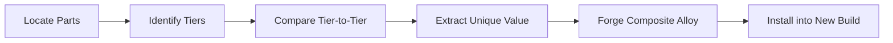
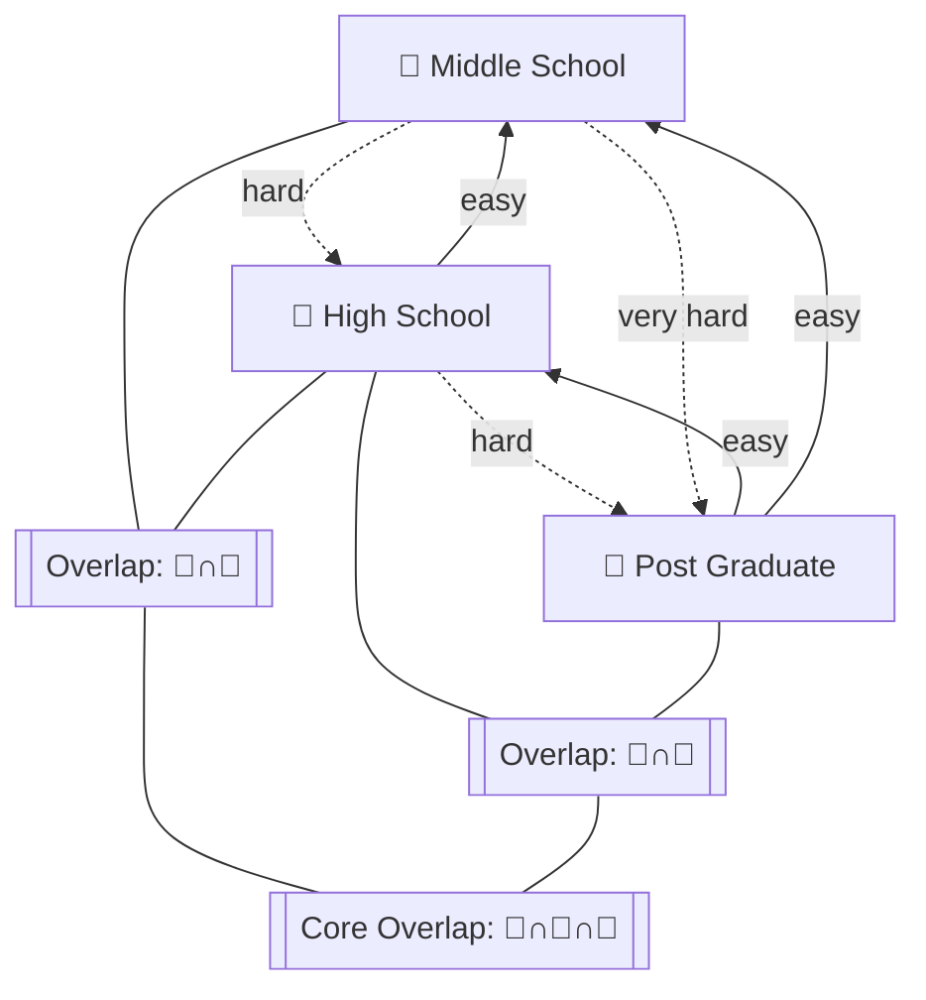

# 📜 Semantic Interference Detection in Prompt Engineering
*A Unified Salvage, Synthesis, and Refactoring Framework for Multi‑Era Concept Reclamation*

---
meta:
  author: Jamie Michael Hill (OverKill Hill P³)
  canonical_alignment: true
  version: 1.0.0
  scope: research, methodology, implementation
  last_updated: 2025-08-11
  status: active
  references:
    - dataLedger_system_v3.md
    - dataLedger_parameters_v3.md
    - dataLedger_persona_v3.md
    - dataLedger_registry_v3.md
  tags:
    - prompt_engineering
    - semantic_interference
    - salvage_framework
    - multi_tier_analysis
    - recursion_aware_refactoring
  tier_labels:
    gold: "🥇 Post Graduate"
    silver: "🥈 High School"
    bronze: "🥉 Middle School"
---
<!--@block:narrative_preamble type=md tags=narrative,metaphor,intro-->
I keep a yard. Not of cars—of concepts. Frames lined up under a wide sky: first ideas with raw edges, mid‑builds with primer showing, and a few that already sparkle in the sun. When I’m ready to assemble the next machine, I don’t grab every part I see. I pick the best piece for each slot, I toss the duplicates, and if a left fender is missing, I forge one. This manual is that yard’s rulebook.

The tiers are simple: 🥉 **Middle School** (raw), 🥈 **High School** (refined), 🥇 **Post Graduate** (canonical). Downhill comprehension is easy—🥇 understands 🥈 and 🥉—but uphill is hard without translation. The work is to keep the crown jewels, shed the rust, and carry forward the sparks that never made it into the final chrome.

<!--/@block-->

<!--@block:quickstart type=md tags=quickstart,fewshot,yaml,mermaid-->
## 🛠 Quickstart Salvage Protocol

**Fender Law:** You can’t build a retro hot rod with **three right fenders and no left**. Pick the best right one, declutter the lesser two, then build/buy/trade for the missing left.

**Tier Rule:** Prefer 🥇; enrich from 🥈 and 🥉; never let lower tiers override mechanics of 🥇.



```yaml
salvage_job:
  theme: "Prompt Engineering — Constraint Handling"
  sources:
    - path: threads/2024-06-08_ConstraintPrompt_v1.md
      tier: "🥉 Middle School"
    - path: prompts/2024-08-02_ConstraintPrompt_v2.md
      tier: "🥈 High School"
    - path: prompts/2024-09-14_ConstraintPrompt_Final.md
      tier: "🥇 Post Graduate"
  rules:
    prefer: "🥇 Post Graduate"
    enrich_from: ["🥈 High School","🥉 Middle School"]
    drop_duplicates: true
    fabricate_missing: true
  output:
    format: markdown
    destination: builds/ConstraintPrompt_Alloy_v1.md
```

<!--/@block-->

<!--@block:vocab_overlap_diagram type=mermaid tags=diagram,vocabulary,overlap-->


<!--/@block-->

<!--@block:canon_rules_v4_2 type=md tags=canon,rules,ledger-->
## Canonical Alignment (v4.2)
- **Precedence:** system > parameters > registry > persona > narrative  
- **Growth‑Only:** never hard‑delete; use `!ARCHIVED` with lineage.  
- **Suffix Law:** `-R` reserved for tools/functions and *ettes*.  
- **Legacy Handling:** `dataLedger_processing_v3.md` is **deprioritized**; if encountered, flag and replace with active system/parameters content.

```yaml
system_rules:
  precedence: [system, parameters, registry, persona, narrative]
  growth_only: true
  suffix_law:
    reserved_suffix: "-R"
    allowed: [tool, tool-ette, function, function-ette]
    on_violation: block
  legacy:
    reject:
      - dataLedger_processing_v3.md
```

<!--/@block-->

<!--@block:detection_framework type=md tags=detection,checklist,fewshot-->
## Detection of Semantic Interference

**Definition:** Unintended change in meaning, scope, or execution semantics introduced during iteration, merge, or style transfer.

**Primary modes:** lexical drift, metaphor bleed, cross‑context contamination, loss of constraints, suffix‑law violations, structural collapse.  
**Secondary modes:** persona displacement, tier misalignment, semantic narrowing, precedence inversion.

```md
# Manual Semantic Interference Review Checklist
1. Read both versions entirely.
2. Highlight vocabulary substitutions (verbs first).
3. Circle removed constraints (MUST/SHALL, checksums, thresholds).
4. Flag metaphors in non‑narrative layers.
5. Verify reserved suffix usage (‑R on tools/functions only).
6. Confirm tier promotion preserved upstream value (🥉→🥈→🥇).
```

```yaml
semantic_diff:
  baseline: "Scan all records for compliance violations."
  candidate: "Review all records for compliance violations."
  embeddings:
    similarity: 0.83
    threshold: 0.86
  lexical_delta:
    - change: "scan" -> "review"   # automation → manual drift
  severity: high
  action: "restore_automation_semantics"
```

<!--/@block-->

<!--@block:join_logic type=md tags=join,sql,yaml,mermaid-->
## Join Logic (Vocabulary → Parts → Canon)

Treat tiers as tables of **parts** (slots): rows are `constraint_block`, `validation_checks`, `examples`, etc.; columns carry **content**, **quality**, **source_ref**.

```mermaid
flowchart TD
    I[Full Tier Merge<br/>(FULL OUTER JOIN)] --> J{Per‑Slot Grouping}
    J --> K[Pick Highest Tier<br/>Tie‑Breakers]
    J --> L[Slot Missing?]
    L -->|Yes| M[Fabricate from Canon Templates<br/>+ Lower‑Tier Hints]
    L -->|No| K
    K --> N[Enrich with Unique Lower‑Tier Nuggets]
    N --> O[One Best Per Slot<br/>Duplicates Discarded]
```

```sql
-- INNER JOIN (overlap‑only)
SELECT s.part_id, s.content AS silver, b.content AS bronze
FROM silver_parts s
INNER JOIN bronze_parts b USING (part_id);

-- LEFT JOIN (prefer higher tier, enrich from lower)
SELECT g.part_id, g.content AS gold_base, s.content AS silver_enrich
FROM gold_parts g
LEFT JOIN silver_parts s USING (part_id);

-- FULL OUTER JOIN (complete inventory)
SELECT COALESCE(g.part_id, s.part_id, b.part_id) AS part_id,
       g.content AS gold, s.content AS silver, b.content AS bronze
FROM gold_parts g
FULL JOIN silver_parts s USING (part_id)
FULL JOIN bronze_parts b USING (part_id);
```

```yaml
salvage_join_blueprint:
  group_by: part_id
  tiers: ["🥇 Post Graduate","🥈 High School","🥉 Middle School"]
  selection:
    prefer: "🥇 Post Graduate"
    tie_breakers: [{quality: desc},{recency: desc},{source_trust: desc}]
  redundancy:
    rule: "keep_one_best"
    drop_duplicates: true
  gap_policy:
    fabricate_if_missing: true
    fabrication_source: "canonical_templates + lower_tier_hints"
  enrichment:
    from_silver_if_unique: ["edge_case","precision_note"]
    from_bronze_if_unique: ["creative_seed","clarifying_example"]
  canon_guards:
    precedence: [system, parameters, registry, persona, narrative]
    growth_only: true
    suffix_law_enforced: true
    reject_legacy: ["dataLedger_processing_v3.md"]
```

<!--/@block-->

<!--@block:remediation_playbooks type=md tags=remediation,playbooks,fewshot-->
## Remediation & Refactoring Playbooks

**Principles:**  
- 🥇 mechanics dominate; 🥈/🥉 may enrich, not override.  
- Growth‑only with `!ARCHIVED`.  
- Enforce precedence and suffix law.

```yaml
remediation: lexical_drift
baseline: "Scan all records for compliance violations before submission."
mutated:  "Review all records for compliance violations before submission."
fix:      "Execute an automated scan of all records, then perform human review of flagged violations before submission."
checks:
  - contains: "automated scan"
  - sequence: ["scan","review","submit"]
commit_note: "Restored automation semantics lost during revision."
```

```yaml
remediation: metaphor_bleed
location: dataLedger_system_v3.md#validation
text: "Bolt on the left fender before the engine fires."
replace: "Run validator A before invoking validator B."
narrative_move: {from: system, to: narrative, reason: "docs‑only illustration"}
```

```yaml
remediation: constraint_loss
missing: "Must validate checksum before accepting uploaded file."
restore: "Validate checksum of the upload manifest; reject on mismatch."
tests:
  - case: "checksum_mismatch"
    expect: "reject"
```

```yaml
remediation: suffix_law
violation: {entity: "NarrativeWeaver-R", issue: "Reserved '-R' used by non‑tool entity."}
action: {rename_to: "NarrativeWeaver", alias_redirect: true}
```

<!--/@block-->

<!--@block:tiered_salvage_pipeline type=md tags=pipeline,ledger,registry-->
## Tiered Salvage Pipeline (Ledger‑First)

Where it lands: `dataLedger_registry_v3.md` (canon) with provenance and hashes.  
Parameters: `dataLedger_parameters_v3.md` (thresholds/toggles).  
Rules: `dataLedger_system_v3.md` (suffix, lifecycle, outputs).

```yaml
pipeline: tiered_salvage
inputs:
  theme: "Process Validation Prompt"
  collect: ["threads/**","prompts/**","files/**/*.md"]
tiers: ["🥉","🥈","🥇"]
stages:
  - inventory: detect_versions
  - normalize: canonicalize_format
  - diff_1: "semantic_diff 🥉→🥈"
  - diff_2: "semantic_diff 🥈→🥇"
  - merge: "enrich_🥇_with_upstream_uniques"
  - validate: "precedence + suffix_law + thresholds"
  - commit: write_🥇_to_registry
  - archive: mark_superseded_as_!ARCHIVED
output:
  export: "CPT-0042.gold.md"
  manifest: "CPT-0042.manifest.yaml"
```

```yaml
registry_entry:
  id: CPT-0042
  name: Process Validation Prompt
  tier: "🥇 Post Graduate"
  version: 3
  status: canon_locked
  lineage:
    "🥉": ["threads/2025-05-14-draftA.md#L120-L166"]
    "🥈": ["prompts/2025-06-01-v1.2.md#sec-2"]
    "🥇": ["files/prompts/master/validation_v3.md#sec-1"]
  compliance: {precedence_ok: true, suffix_ok: true, growth_only: true}
  export: {sha256: "b0b9…f3a1", path: "files/prompts/master/validation_v3.md"}
```

<!--/@block-->

<!--@block:fabrication_left_fender type=md tags=fabrication,mermaid,yaml-->
## Fabrication: Making the Missing Left Fender

When a slot is missing at all tiers, fabricate a canonical version from templates + hints.

```mermaid
flowchart TD
    X[Slot Missing (e.g., validation_checks)] --> T[Pull Canon Template]
    T --> H[Harvest Hints from Adjacent Slots<br/>(examples, constraints)]
    H --> S[Draft Fabricated Slot]
    S --> V[Validate: Precedence + Suffix + Tests]
    V --> C[Commit as 🥈 or 🥇]
```

```yaml
fabrication:
  slot: "validation_checks"
  sources:
    canonical_template: "templates/validation_checks.md"
    hints_from: ["constraint_block","examples"]
  draft:
    tier: "🥈 High School"
    promote_if:
      - passes_all_checks: true
      - covers_edge_cases: true
  commit_note: "Fabricated missing left fender from canon template + adjacent hints."
```

<!--/@block-->

<!--@block:examples_library type=md tags=fewshot,library,linter-->
## Examples Library (Few‑Shot, Callable)

```yaml
pattern: restore_automation
before: "Review all records for issues."
after:  "Execute an automated scan of all records, then review flagged issues."
signal: "manual‑only verb"
```

```yaml
pattern: de_metaphorize
before: "Bolt on the fender before the engine fires."
after:  "Run validator A before invoking validator B."
signal: "metaphor token in system layer"
```

```yaml
pattern: restore_must
before: "Validate file before acceptance."
after:  "Must validate checksum prior to acceptance; reject on mismatch."
signal: "downgraded modality (must→should→implicit)"
```

```yaml
linter: semantic_guard
rules:
  - id: LEX-001
    description: "Automation semantics required when using 'scan'"
    detect: "contains('scan') and not contains_any(['automated','execute'])"
    severity: high
  - id: MET-002
    description: "No metaphor tokens in system layer"
    detect: "layer=='system' and contains_any(['fender','engine','junkyard'])"
    severity: medium
  - id: CON-003
    description: "Checksum MUST present on upload/accept path"
    detect: "path=='upload/accept' and not contains('checksum')"
    severity: critical
```

<!--/@block-->

<!--@block:command_phrases type=md tags=commands,runtime-->
## Command Phrases (for GPT Runtime)
- "Run Concept Salvage on [theme]"
- "Group parts by slot, keep one best, fabricate gaps"
- "Apply Fender Law and discard redundant right‑side duplicates"
- "Promote 🥈 to 🥇 for [slot], preserve unique 🥉 nuggets"
- "Run drift audit; restore lost MUSTs; enforce suffix law"

<!--/@block-->

<!--@block:faq type=md tags=faq-->
## FAQ (Terse)
**Why not keep multiple right fenders?**  
Redundancy increases drift risk. Keep **one best** and archive the rest with lineage.

**When does 🥉 enrich 🥇?**  
Only when unique and mechanistically neutral—creative seeds, examples, edge cases.

**What if a 🥇 part is missing?**  
Promote 🥈, enrich from 🥉, and fabricate the residual gap from canonical templates.

<!--/@block-->

<!--@block:pull_sequence type=md tags=pull,done,criteria-->
## Canonical Pull Sequence & Definition of Done

```md
1) Load canon: system_v3 → parameters_v3 → registry_v3 → persona_v3 → narrative_v3 → hydration_v3
2) Run drift audit (flag legacy refs; remove 'processing_v3')
3) Merge per precedence; prefer 🥇 parts; enrich from 🥈/🥉 uniques
4) Export Gold artifact; compute SHA; update manifest
5) Snapshot hydration for reproducibility
```

```yaml
done_criteria:
  mechanics_intact: true
  upstream_value_carried: true
  precedence_pass: true
  suffix_pass: true
  tests_green: true
  manifest_updated: true
  archived_variants_tagged: true
```

<!--/@block-->

<!--@block:worked_example_01 type=md tags=worked,example,merge-->
## Worked Example #01: Constraint Handling Upgrade

**Scenario:** Upgrading a constraint‑handling prompt from 🥈 to 🥇 while preserving 🥉 edge‑case creativity.

**Inputs:**
```yaml
silver_clause: "Validate inputs before processing."
bronze_seed: "If input has unknown fields, ask a clarifying question."
gold_base: "Enforce canonical schema validation with checksum before processing."
```

**Diff & Merge:**
```yaml
diff:
  🥈→🥇:
    - add: "checksum requirement"
    - replace: "before processing" -> "prior to any side‑effects"
  🥉→🥈:
    - carry: "clarifying question on unknown fields"
merge_result:
  clause: >
    Enforce canonical schema validation with checksum prior to any side‑effects.
    If unknown fields are detected, ask a clarifying question before continuing.
```

**Validation:**
```yaml
checks:
  precedence_ok: true
  suffix_ok: true
  tests_green: true
```

<!--/@block-->

<!--@block:worked_example_02 type=md tags=worked,example,merge-->
## Worked Example #02: Constraint Handling Upgrade

**Scenario:** Upgrading a constraint‑handling prompt from 🥈 to 🥇 while preserving 🥉 edge‑case creativity.

**Inputs:**
```yaml
silver_clause: "Validate inputs before processing."
bronze_seed: "If input has unknown fields, ask a clarifying question."
gold_base: "Enforce canonical schema validation with checksum before processing."
```

**Diff & Merge:**
```yaml
diff:
  🥈→🥇:
    - add: "checksum requirement"
    - replace: "before processing" -> "prior to any side‑effects"
  🥉→🥈:
    - carry: "clarifying question on unknown fields"
merge_result:
  clause: >
    Enforce canonical schema validation with checksum prior to any side‑effects.
    If unknown fields are detected, ask a clarifying question before continuing.
```

**Validation:**
```yaml
checks:
  precedence_ok: true
  suffix_ok: true
  tests_green: true
```

<!--/@block-->

<!--@block:worked_example_03 type=md tags=worked,example,merge-->
## Worked Example #03: Constraint Handling Upgrade

**Scenario:** Upgrading a constraint‑handling prompt from 🥈 to 🥇 while preserving 🥉 edge‑case creativity.

**Inputs:**
```yaml
silver_clause: "Validate inputs before processing."
bronze_seed: "If input has unknown fields, ask a clarifying question."
gold_base: "Enforce canonical schema validation with checksum before processing."
```

**Diff & Merge:**
```yaml
diff:
  🥈→🥇:
    - add: "checksum requirement"
    - replace: "before processing" -> "prior to any side‑effects"
  🥉→🥈:
    - carry: "clarifying question on unknown fields"
merge_result:
  clause: >
    Enforce canonical schema validation with checksum prior to any side‑effects.
    If unknown fields are detected, ask a clarifying question before continuing.
```

**Validation:**
```yaml
checks:
  precedence_ok: true
  suffix_ok: true
  tests_green: true
```

<!--/@block-->

<!--@block:worked_example_04 type=md tags=worked,example,merge-->
## Worked Example #04: Constraint Handling Upgrade

**Scenario:** Upgrading a constraint‑handling prompt from 🥈 to 🥇 while preserving 🥉 edge‑case creativity.

**Inputs:**
```yaml
silver_clause: "Validate inputs before processing."
bronze_seed: "If input has unknown fields, ask a clarifying question."
gold_base: "Enforce canonical schema validation with checksum before processing."
```

**Diff & Merge:**
```yaml
diff:
  🥈→🥇:
    - add: "checksum requirement"
    - replace: "before processing" -> "prior to any side‑effects"
  🥉→🥈:
    - carry: "clarifying question on unknown fields"
merge_result:
  clause: >
    Enforce canonical schema validation with checksum prior to any side‑effects.
    If unknown fields are detected, ask a clarifying question before continuing.
```

**Validation:**
```yaml
checks:
  precedence_ok: true
  suffix_ok: true
  tests_green: true
```

<!--/@block-->

<!--@block:worked_example_05 type=md tags=worked,example,merge-->
## Worked Example #05: Constraint Handling Upgrade

**Scenario:** Upgrading a constraint‑handling prompt from 🥈 to 🥇 while preserving 🥉 edge‑case creativity.

**Inputs:**
```yaml
silver_clause: "Validate inputs before processing."
bronze_seed: "If input has unknown fields, ask a clarifying question."
gold_base: "Enforce canonical schema validation with checksum before processing."
```

**Diff & Merge:**
```yaml
diff:
  🥈→🥇:
    - add: "checksum requirement"
    - replace: "before processing" -> "prior to any side‑effects"
  🥉→🥈:
    - carry: "clarifying question on unknown fields"
merge_result:
  clause: >
    Enforce canonical schema validation with checksum prior to any side‑effects.
    If unknown fields are detected, ask a clarifying question before continuing.
```

**Validation:**
```yaml
checks:
  precedence_ok: true
  suffix_ok: true
  tests_green: true
```

<!--/@block-->

<!--@block:worked_example_06 type=md tags=worked,example,merge-->
## Worked Example #06: Constraint Handling Upgrade

**Scenario:** Upgrading a constraint‑handling prompt from 🥈 to 🥇 while preserving 🥉 edge‑case creativity.

**Inputs:**
```yaml
silver_clause: "Validate inputs before processing."
bronze_seed: "If input has unknown fields, ask a clarifying question."
gold_base: "Enforce canonical schema validation with checksum before processing."
```

**Diff & Merge:**
```yaml
diff:
  🥈→🥇:
    - add: "checksum requirement"
    - replace: "before processing" -> "prior to any side‑effects"
  🥉→🥈:
    - carry: "clarifying question on unknown fields"
merge_result:
  clause: >
    Enforce canonical schema validation with checksum prior to any side‑effects.
    If unknown fields are detected, ask a clarifying question before continuing.
```

**Validation:**
```yaml
checks:
  precedence_ok: true
  suffix_ok: true
  tests_green: true
```

<!--/@block-->

<!--@block:worked_example_07 type=md tags=worked,example,merge-->
## Worked Example #07: Constraint Handling Upgrade

**Scenario:** Upgrading a constraint‑handling prompt from 🥈 to 🥇 while preserving 🥉 edge‑case creativity.

**Inputs:**
```yaml
silver_clause: "Validate inputs before processing."
bronze_seed: "If input has unknown fields, ask a clarifying question."
gold_base: "Enforce canonical schema validation with checksum before processing."
```

**Diff & Merge:**
```yaml
diff:
  🥈→🥇:
    - add: "checksum requirement"
    - replace: "before processing" -> "prior to any side‑effects"
  🥉→🥈:
    - carry: "clarifying question on unknown fields"
merge_result:
  clause: >
    Enforce canonical schema validation with checksum prior to any side‑effects.
    If unknown fields are detected, ask a clarifying question before continuing.
```

**Validation:**
```yaml
checks:
  precedence_ok: true
  suffix_ok: true
  tests_green: true
```

<!--/@block-->

<!--@block:worked_example_08 type=md tags=worked,example,merge-->
## Worked Example #08: Constraint Handling Upgrade

**Scenario:** Upgrading a constraint‑handling prompt from 🥈 to 🥇 while preserving 🥉 edge‑case creativity.

**Inputs:**
```yaml
silver_clause: "Validate inputs before processing."
bronze_seed: "If input has unknown fields, ask a clarifying question."
gold_base: "Enforce canonical schema validation with checksum before processing."
```

**Diff & Merge:**
```yaml
diff:
  🥈→🥇:
    - add: "checksum requirement"
    - replace: "before processing" -> "prior to any side‑effects"
  🥉→🥈:
    - carry: "clarifying question on unknown fields"
merge_result:
  clause: >
    Enforce canonical schema validation with checksum prior to any side‑effects.
    If unknown fields are detected, ask a clarifying question before continuing.
```

**Validation:**
```yaml
checks:
  precedence_ok: true
  suffix_ok: true
  tests_green: true
```

<!--/@block-->

<!--@block:worked_example_09 type=md tags=worked,example,merge-->
## Worked Example #09: Constraint Handling Upgrade

**Scenario:** Upgrading a constraint‑handling prompt from 🥈 to 🥇 while preserving 🥉 edge‑case creativity.

**Inputs:**
```yaml
silver_clause: "Validate inputs before processing."
bronze_seed: "If input has unknown fields, ask a clarifying question."
gold_base: "Enforce canonical schema validation with checksum before processing."
```

**Diff & Merge:**
```yaml
diff:
  🥈→🥇:
    - add: "checksum requirement"
    - replace: "before processing" -> "prior to any side‑effects"
  🥉→🥈:
    - carry: "clarifying question on unknown fields"
merge_result:
  clause: >
    Enforce canonical schema validation with checksum prior to any side‑effects.
    If unknown fields are detected, ask a clarifying question before continuing.
```

**Validation:**
```yaml
checks:
  precedence_ok: true
  suffix_ok: true
  tests_green: true
```

<!--/@block-->

<!--@block:worked_example_10 type=md tags=worked,example,merge-->
## Worked Example #10: Constraint Handling Upgrade

**Scenario:** Upgrading a constraint‑handling prompt from 🥈 to 🥇 while preserving 🥉 edge‑case creativity.

**Inputs:**
```yaml
silver_clause: "Validate inputs before processing."
bronze_seed: "If input has unknown fields, ask a clarifying question."
gold_base: "Enforce canonical schema validation with checksum before processing."
```

**Diff & Merge:**
```yaml
diff:
  🥈→🥇:
    - add: "checksum requirement"
    - replace: "before processing" -> "prior to any side‑effects"
  🥉→🥈:
    - carry: "clarifying question on unknown fields"
merge_result:
  clause: >
    Enforce canonical schema validation with checksum prior to any side‑effects.
    If unknown fields are detected, ask a clarifying question before continuing.
```

**Validation:**
```yaml
checks:
  precedence_ok: true
  suffix_ok: true
  tests_green: true
```

<!--/@block-->

<!--@block:worked_example_11 type=md tags=worked,example,merge-->
## Worked Example #11: Constraint Handling Upgrade

**Scenario:** Upgrading a constraint‑handling prompt from 🥈 to 🥇 while preserving 🥉 edge‑case creativity.

**Inputs:**
```yaml
silver_clause: "Validate inputs before processing."
bronze_seed: "If input has unknown fields, ask a clarifying question."
gold_base: "Enforce canonical schema validation with checksum before processing."
```

**Diff & Merge:**
```yaml
diff:
  🥈→🥇:
    - add: "checksum requirement"
    - replace: "before processing" -> "prior to any side‑effects"
  🥉→🥈:
    - carry: "clarifying question on unknown fields"
merge_result:
  clause: >
    Enforce canonical schema validation with checksum prior to any side‑effects.
    If unknown fields are detected, ask a clarifying question before continuing.
```

**Validation:**
```yaml
checks:
  precedence_ok: true
  suffix_ok: true
  tests_green: true
```

<!--/@block-->

<!--@block:worked_example_12 type=md tags=worked,example,merge-->
## Worked Example #12: Constraint Handling Upgrade

**Scenario:** Upgrading a constraint‑handling prompt from 🥈 to 🥇 while preserving 🥉 edge‑case creativity.

**Inputs:**
```yaml
silver_clause: "Validate inputs before processing."
bronze_seed: "If input has unknown fields, ask a clarifying question."
gold_base: "Enforce canonical schema validation with checksum before processing."
```

**Diff & Merge:**
```yaml
diff:
  🥈→🥇:
    - add: "checksum requirement"
    - replace: "before processing" -> "prior to any side‑effects"
  🥉→🥈:
    - carry: "clarifying question on unknown fields"
merge_result:
  clause: >
    Enforce canonical schema validation with checksum prior to any side‑effects.
    If unknown fields are detected, ask a clarifying question before continuing.
```

**Validation:**
```yaml
checks:
  precedence_ok: true
  suffix_ok: true
  tests_green: true
```

<!--/@block-->

<!--@block:worked_example_13 type=md tags=worked,example,merge-->
## Worked Example #13: Constraint Handling Upgrade

**Scenario:** Upgrading a constraint‑handling prompt from 🥈 to 🥇 while preserving 🥉 edge‑case creativity.

**Inputs:**
```yaml
silver_clause: "Validate inputs before processing."
bronze_seed: "If input has unknown fields, ask a clarifying question."
gold_base: "Enforce canonical schema validation with checksum before processing."
```

**Diff & Merge:**
```yaml
diff:
  🥈→🥇:
    - add: "checksum requirement"
    - replace: "before processing" -> "prior to any side‑effects"
  🥉→🥈:
    - carry: "clarifying question on unknown fields"
merge_result:
  clause: >
    Enforce canonical schema validation with checksum prior to any side‑effects.
    If unknown fields are detected, ask a clarifying question before continuing.
```

**Validation:**
```yaml
checks:
  precedence_ok: true
  suffix_ok: true
  tests_green: true
```

<!--/@block-->

<!--@block:worked_example_14 type=md tags=worked,example,merge-->
## Worked Example #14: Constraint Handling Upgrade

**Scenario:** Upgrading a constraint‑handling prompt from 🥈 to 🥇 while preserving 🥉 edge‑case creativity.

**Inputs:**
```yaml
silver_clause: "Validate inputs before processing."
bronze_seed: "If input has unknown fields, ask a clarifying question."
gold_base: "Enforce canonical schema validation with checksum before processing."
```

**Diff & Merge:**
```yaml
diff:
  🥈→🥇:
    - add: "checksum requirement"
    - replace: "before processing" -> "prior to any side‑effects"
  🥉→🥈:
    - carry: "clarifying question on unknown fields"
merge_result:
  clause: >
    Enforce canonical schema validation with checksum prior to any side‑effects.
    If unknown fields are detected, ask a clarifying question before continuing.
```

**Validation:**
```yaml
checks:
  precedence_ok: true
  suffix_ok: true
  tests_green: true
```

<!--/@block-->

<!--@block:worked_example_15 type=md tags=worked,example,merge-->
## Worked Example #15: Constraint Handling Upgrade

**Scenario:** Upgrading a constraint‑handling prompt from 🥈 to 🥇 while preserving 🥉 edge‑case creativity.

**Inputs:**
```yaml
silver_clause: "Validate inputs before processing."
bronze_seed: "If input has unknown fields, ask a clarifying question."
gold_base: "Enforce canonical schema validation with checksum before processing."
```

**Diff & Merge:**
```yaml
diff:
  🥈→🥇:
    - add: "checksum requirement"
    - replace: "before processing" -> "prior to any side‑effects"
  🥉→🥈:
    - carry: "clarifying question on unknown fields"
merge_result:
  clause: >
    Enforce canonical schema validation with checksum prior to any side‑effects.
    If unknown fields are detected, ask a clarifying question before continuing.
```

**Validation:**
```yaml
checks:
  precedence_ok: true
  suffix_ok: true
  tests_green: true
```

<!--/@block-->

<!--@block:worked_example_16 type=md tags=worked,example,merge-->
## Worked Example #16: Constraint Handling Upgrade

**Scenario:** Upgrading a constraint‑handling prompt from 🥈 to 🥇 while preserving 🥉 edge‑case creativity.

**Inputs:**
```yaml
silver_clause: "Validate inputs before processing."
bronze_seed: "If input has unknown fields, ask a clarifying question."
gold_base: "Enforce canonical schema validation with checksum before processing."
```

**Diff & Merge:**
```yaml
diff:
  🥈→🥇:
    - add: "checksum requirement"
    - replace: "before processing" -> "prior to any side‑effects"
  🥉→🥈:
    - carry: "clarifying question on unknown fields"
merge_result:
  clause: >
    Enforce canonical schema validation with checksum prior to any side‑effects.
    If unknown fields are detected, ask a clarifying question before continuing.
```

**Validation:**
```yaml
checks:
  precedence_ok: true
  suffix_ok: true
  tests_green: true
```

<!--/@block-->

<!--@block:worked_example_17 type=md tags=worked,example,merge-->
## Worked Example #17: Constraint Handling Upgrade

**Scenario:** Upgrading a constraint‑handling prompt from 🥈 to 🥇 while preserving 🥉 edge‑case creativity.

**Inputs:**
```yaml
silver_clause: "Validate inputs before processing."
bronze_seed: "If input has unknown fields, ask a clarifying question."
gold_base: "Enforce canonical schema validation with checksum before processing."
```

**Diff & Merge:**
```yaml
diff:
  🥈→🥇:
    - add: "checksum requirement"
    - replace: "before processing" -> "prior to any side‑effects"
  🥉→🥈:
    - carry: "clarifying question on unknown fields"
merge_result:
  clause: >
    Enforce canonical schema validation with checksum prior to any side‑effects.
    If unknown fields are detected, ask a clarifying question before continuing.
```

**Validation:**
```yaml
checks:
  precedence_ok: true
  suffix_ok: true
  tests_green: true
```

<!--/@block-->

<!--@block:worked_example_18 type=md tags=worked,example,merge-->
## Worked Example #18: Constraint Handling Upgrade

**Scenario:** Upgrading a constraint‑handling prompt from 🥈 to 🥇 while preserving 🥉 edge‑case creativity.

**Inputs:**
```yaml
silver_clause: "Validate inputs before processing."
bronze_seed: "If input has unknown fields, ask a clarifying question."
gold_base: "Enforce canonical schema validation with checksum before processing."
```

**Diff & Merge:**
```yaml
diff:
  🥈→🥇:
    - add: "checksum requirement"
    - replace: "before processing" -> "prior to any side‑effects"
  🥉→🥈:
    - carry: "clarifying question on unknown fields"
merge_result:
  clause: >
    Enforce canonical schema validation with checksum prior to any side‑effects.
    If unknown fields are detected, ask a clarifying question before continuing.
```

**Validation:**
```yaml
checks:
  precedence_ok: true
  suffix_ok: true
  tests_green: true
```

<!--/@block-->

<!--@block:worked_example_19 type=md tags=worked,example,merge-->
## Worked Example #19: Constraint Handling Upgrade

**Scenario:** Upgrading a constraint‑handling prompt from 🥈 to 🥇 while preserving 🥉 edge‑case creativity.

**Inputs:**
```yaml
silver_clause: "Validate inputs before processing."
bronze_seed: "If input has unknown fields, ask a clarifying question."
gold_base: "Enforce canonical schema validation with checksum before processing."
```

**Diff & Merge:**
```yaml
diff:
  🥈→🥇:
    - add: "checksum requirement"
    - replace: "before processing" -> "prior to any side‑effects"
  🥉→🥈:
    - carry: "clarifying question on unknown fields"
merge_result:
  clause: >
    Enforce canonical schema validation with checksum prior to any side‑effects.
    If unknown fields are detected, ask a clarifying question before continuing.
```

**Validation:**
```yaml
checks:
  precedence_ok: true
  suffix_ok: true
  tests_green: true
```

<!--/@block-->

<!--@block:worked_example_20 type=md tags=worked,example,merge-->
## Worked Example #20: Constraint Handling Upgrade

**Scenario:** Upgrading a constraint‑handling prompt from 🥈 to 🥇 while preserving 🥉 edge‑case creativity.

**Inputs:**
```yaml
silver_clause: "Validate inputs before processing."
bronze_seed: "If input has unknown fields, ask a clarifying question."
gold_base: "Enforce canonical schema validation with checksum before processing."
```

**Diff & Merge:**
```yaml
diff:
  🥈→🥇:
    - add: "checksum requirement"
    - replace: "before processing" -> "prior to any side‑effects"
  🥉→🥈:
    - carry: "clarifying question on unknown fields"
merge_result:
  clause: >
    Enforce canonical schema validation with checksum prior to any side‑effects.
    If unknown fields are detected, ask a clarifying question before continuing.
```

**Validation:**
```yaml
checks:
  precedence_ok: true
  suffix_ok: true
  tests_green: true
```

<!--/@block-->

