# PlantUML Syntax — Extended Knowledge for PathScrib‑R

**Purpose**  
Equip PathScrib‑R with a precise, implementation‑ready understanding of PlantUML so it can generate clean, readable, and standards‑aware diagrams alongside BPMN and Mermaid. This guide covers block structure, core syntax, styling, common diagram types, mapping from process concepts to PlantUML constructs, and selection guidance (PlantUML vs. BPMN vs. Mermaid).

---

## 1) What PlantUML Is (and isn’t)
PlantUML is a **text‑driven diagram engine** that supports many diagram families (UML and beyond). It prioritizes **flexibility and extensibility** over minimal syntax. Files commonly use the extensions `.puml` or `.iuml` and render to PNG/SVG/ASCII, with SVG preferred for crisp scaling and link embedding.

Key traits:
- **Text first** → versionable, diffable, automatable.
- **Broad coverage** → sequence, activity, class, component, deployment, use case, state, timing, WBS, mindmap, and more.
- **Theme & skinparam system** → consistent branding and readability.
- **Fast iteration** → amenable to CI, docs‑as‑code, and code review workflows.

PlantUML is **not** a BPMN engine; it can *approximate* process notations but won’t enforce BPMN semantics. Treat it as a complementary view, especially for developer‑facing documentation.

---

## 2) Block Anatomy & File Structure
A minimal file:
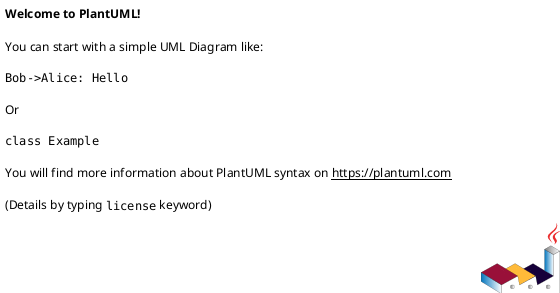

Common header/footer elements:
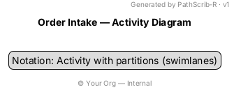

**Includes & reuse**
- `!include path/to/shared-theme.puml` for centralized styles.
- `!define`/`!unquoted` for macros; `!if` for conditional blocks.

---

## 3) Styling Fundamentals (Skinparam, Stereotypes, Themes)

**Skinparam** sets visual properties globally or per‑type:
```plantuml
skinparam ArrowColor #333
skinparam ActivityBackgroundColor #f8f9fb
skinparam ActivityBorderColor #999
skinparam ActivityFontSize 13
skinparam PartitionBorderColor #bbb
skinparam shadowing false
```

**Stereotypes** (`<<service>>`, `<<manual>>`) can style groups of elements. Pair with `skinparam class {}`/`component {}` blocks or `<<stereotype>>` + `skinparam stereotypeFontColor`.

**Themes** provide preset palettes/spacing. Prefer a single project‑level theme to ensure consistency across diagrams.

Readability heuristics for PathScrib‑R outputs:
- Prefer **SVG** with embedded links.
- Keep **contrast high**, borders subtle, fonts 12–13pt equivalent.
- Limit color to **semantic accents** (status, lane, risk) rather than decoration.

---

## 4) Activity Diagrams (Process‑like flows)
Activity diagrams are the closest PlantUML analogue to basic business process flows.

### 4.1 Syntax essentials
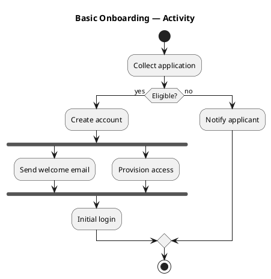

### 4.2 Partitions (swimlanes)
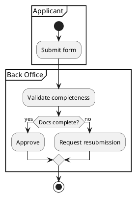

### 4.3 Loops & groups
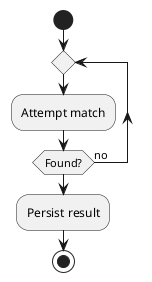

**Notes**: Use `note left/right` attached to an activity for clarifications. Use `detach` sparingly to avoid orphaned flows.

---

## 5) Sequence Diagrams (Interactions & Interviews)
Ideal for **stakeholder interviews** translated into temporal exchanges: who asks, who answers, what systems are consulted.

### 5.1 Syntax essentials
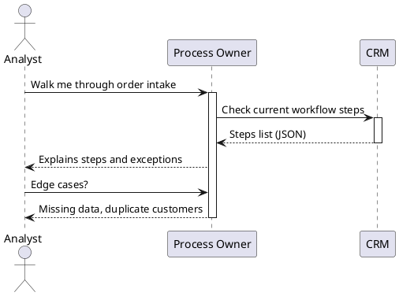

**Fragments** (`alt/else/opt/loop/par`):
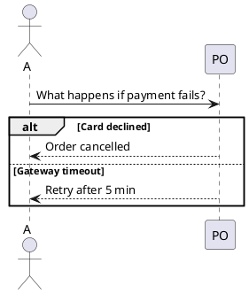

Use `activate/deactivate` to show focus, and `create/destroy` for lifeline lifecycle where relevant.

---

## 6) Class, Component, Deployment, Use Case — Quick Patterns

### 6.1 Class
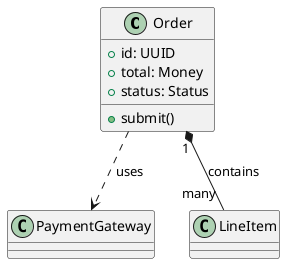

### 6.2 Component
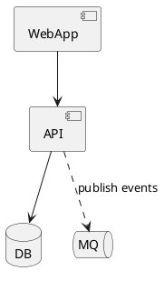

### 6.3 Deployment
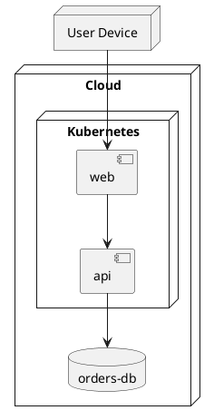

### 6.4 Use Case
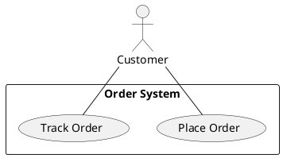

---

## 7) Mapping Process Concepts → PlantUML Activity Constructs

| Process Concept (BPMN-ish) | PlantUML Activity Equivalent | Notes |
|---|---|---|
| Start Event | `start` | One per entry point (keep to one for clarity) |
| End Event | `stop`/`end` | Prefer a single terminal per path |
| Task | `:Verb phrase;` | Each activity is a single, testable action |
| User Task | Activity in a `partition` (role) | Name partitions by **actor/role** |
| Service Task | Activity with stereotype `<<service>>` or color | Optionally add note with API/system |
| Exclusive Gateway (XOR) | `if (Question?) then/else` | Keep conditions short; annotate outcomes |
| Parallel Gateway (AND) | `fork` / `fork again` / `end fork` | Avoid >3 branches per fork |
| Subprocess | Grouped activities or separate diagram | Link via note: `[[Subprocess.svg]]` |
| Boundary/Event | `note` + guard on transition | Model timers/messages as decision guards |
| Swimlane | `partition "Role" { ... }` | Keep 2–5 lanes for legibility |

---

## 8) From Interviews to Diagrams — A Mini Workflow
1. **Transcribe** interview lines as `<speaker> says ...`.
2. **Cluster** statements by topic (trigger, main flow, exceptions, data).
3. **Decide view**:
   - **Activity** for control flow (happy path + branches).
   - **Sequence** for handoffs and timing.
4. **Draft** PlantUML with partitions (roles) or actors (sequence).
5. **Annotate** assumptions with `note` blocks.
6. **Style** with project theme + minimal color.
7. **Validate** using QA rules (below) and render to SVG.

---

## 9) PathScrib‑R Output Conventions
- **File naming**: `processKey_view_yyyymmdd.puml` (e.g., `orderIntake_activity_20250818.puml`).
- **Header** includes: title, generator tag, version, optional `legend`.
- **SVG export** with links to related artifacts (requirements doc, BPMN XML, test cases).
- **Partition/Actor names** use business‑friendly labels (avoid acronyms unless defined).
- **One diagram = one audience intent** (don’t blend architecture with process control flow).

---

## 10) Readability & QA Checklist (auto‑enforce where feasible)
- **Start/End present** (activity) and all paths terminate.
- **Max 12–18 nodes** per diagram; split if larger.
- **Gateways**: each branch labeled; no dangling merges.
- **Parallel sections**: use `fork`/`end fork` with ≤3 branches.
- **Swimlanes**: 2–5 partitions; each lane has ≥1 activity.
- **Notes**: used for non‑obvious rules, not as a crutch for missing steps.
- **Styling**: single theme; font legible; colors meaningful.
- **Links**: external references valid (requirements, BPMN, tests).

---

## 11) Advanced Features (use judiciously)
- **`!includeurl`** for remote themes (lock to vetted, internal URLs only).
- **Sprites & Icons** via `sprite` or built‑ins to tag tasks (e.g., API, DB). Keep subtle.
- **`newpage`** to paginate very large diagrams (prefer split into separate files).
- **`autonumber`** in sequence diagrams for traceability to steps.

---

## 12) Example: Process to Activity + Sequence Pair

### 12.1 Activity (high‑level control flow)
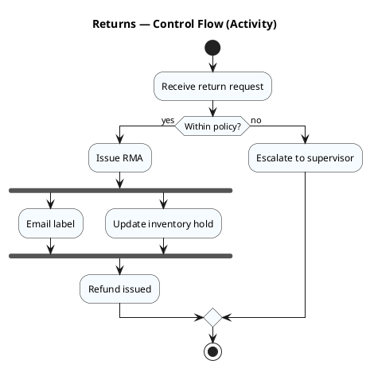

### 12.2 Sequence (who talks to whom)
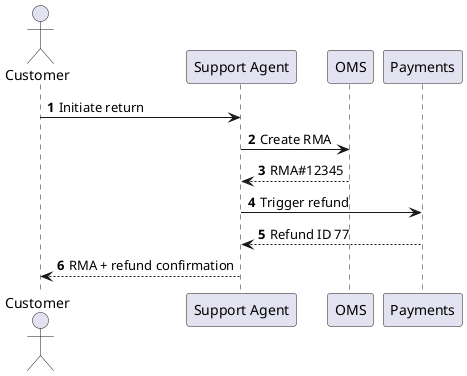

---

## 13) When to Choose PlantUML vs. BPMN vs. Mermaid

| Criterion | PlantUML | BPMN 2.0 | Mermaid |
|---|---|---|---|
| **Primary Audience** | Developers, architects | Business + governance | Analysts, general audiences |
| **Expressiveness** | Very high across diagram types | High for process semantics | Moderate; simple flows |
| **Formality/Semantics** | Informal (UML‑style) | Formal, standard semantics | Informal |
| **Learning Curve** | Moderate | Higher (full spec) | Low |
| **Tooling/Export** | Rich (SVG, themes, includes) | XML interchange, industry tools | Simple, web‑native |
| **Best For** | System views, interactions, doc‑as‑code | Enterprise processes, governance | Quick drafts, docs, Markdown |

**Guidance**
- Choose **BPMN** when the organization requires **process governance**, executable models, or interchange with BPM suites.
- Choose **PlantUML** for **developer‑adjacent views** (sequence, component, deployment) and when reusable theming and includes matter.
- Choose **Mermaid** for **lightweight onboarding**, inline docs, or fast ideation.

---

## 14) Authoring Patterns for PathScrib‑R
- **Two‑view pattern**: generate an **Activity** (control flow) and a **Sequence** (handoffs) for the same scenario.
- **Split‑by‑role**: partitions by role so responsibilities are visually clear.
- **Link‑out**: add notes with `[[bpmn.xml]]`, `[[policy.md]]`, `[[gherkin.feature]]` to connect assets.
- **Theme discipline**: a single theme across a repository; skinparams only for semantic exceptions.

---

## 15) Starter Snippets (copy/paste)

**Activity template**
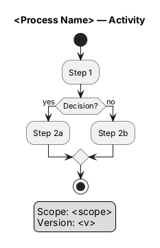

**Sequence template**
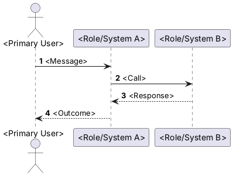

---

## 16) Governance Hooks for PathScrib‑R
- Enforce the **QA checklist** before export.
- Stamp each SVG with a generator footer and commit hash.
- Maintain a central `theme.puml`; disallow per‑diagram color drift.
- Validate links and partition names against a controlled glossary.

---

## 17) Known Pitfalls & Fixes
- **Spaghetti flows** → Split by sub‑process; keep nodes ≤18.
- **Over‑branched gateways** → Convert to numbered decision list + separate sub‑diagram.
- **Lane explosion** → Merge similar roles; annotate fine distinctions in notes.
- **Color clutter** → Limit to 1–2 semantic accents; rely on layout and labels first.

---

## 18) Summary
PlantUML augments PathScrib‑R with a **developer‑friendly, richly styleable** diagram path that pairs well with BPMN governance and Mermaid agility. Use it when **interactions, components, and deployments** matter, or when a **docs‑as‑code** workflow is desired. Keep outputs disciplined via themes, QA checks, and audience‑aligned scoping.

