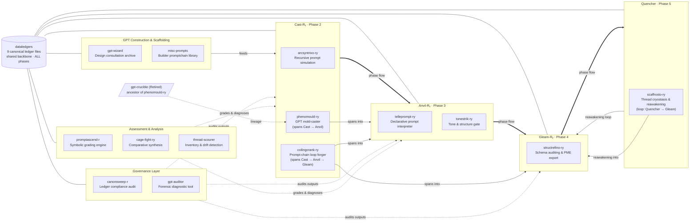

# OverKill-Hill-FoundRy

The private forge of OverKill Hill P³™ — where experimental architectures, recursive ledgers, promptcraft systems, local AI workbenches, narrative frameworks, and prototype agents are cast, refined, and stress-tested before public release.

> **Repository identity:** OverKill Hill FoundRy is the primary identity and purpose of this repository. It is a private governance relay, not a public product repository. **ReFolDec** (Recursively Folding Codec) is a FoundRy-hosted capability: its specifications and release materials may be developed here, but any public ReFolDec artifact must graduate to a separately approved public surface.

## Role

This repository is the OverKill Hill P³ FoundRy relay. It sits between the golden governance in `OKHP3/OverKill-Hill` and the child repositories that carry OKH research, writing, apps, skills, and capability prototypes.

```text
OKHP3/OverKill-Hill
  → OKHP3/OverKill-Hill-FoundRy
    → foundry-*, vault-*, article-*, mermaid-*, mac-studio-*, narrative-* child repos
```

### ReFolDec relationship and publication boundary

ReFolDec is a bidirectional process-capture and transformation capability maintained within the FoundRy. It folds raw material into durable artifacts, unfolds mature artifacts into reusable primitives, and refolds those primitives into stronger outputs.

- **FoundRy repository:** private governance and development relay.
- **ReFolDec within this repository:** hosted capability and release scaffold.
- **Public ReFolDec:** a future, separately reviewed artifact surface; it must not expose private FoundRy, Notion, client, or employer material.

The FoundRy’s private status does not make ReFolDec public, and ReFolDec’s future public release does not rename or change the visibility of this repository.

## Responsibilities

- Maintain OKH child repository scaffolds in `_template/`.
- Maintain OKH child repository registry files in `registry/`.
- Maintain manifest and registry schemas in `schemas/`.
- Document governance and migration practice in `docs/`.
- Provide GitHub workflow and issue template scaffolding in `.github/`.

## Governed Repository Families

- `foundry-*`
- `vault-*`
- `article-*`
- `narrative-*`
- `mermaid-*`
- `mac-studio-*`
- OKH research, writing, promptcraft, local AI, and systems-design repositories

## Operating Principle

A repository should preserve the durable capability, not merely the latest platform wrapper. GPTs, skills, agents, articles, websites, local modules, and MCP-facing assets are deployment targets.

---

## Capability Catalog

The 16 capability folders in this repository span the full lifecycle of GPT construction, validation, and governance within the OverKill Hill P³ / GPT Found‑Rᵧ ecosystem — from raw ideation through canon-sealed export.

### Pipeline Diagram



**Phase guide:** **Cast-Rᵧ (Phase 2)** is where raw prompt ideas are stress-tested, mold-cast into schema-bound GPT forms, and looped through clause-chain forging — surviving prompts leave this phase structurally sound. **Anvil-Rᵧ (Phase 3)** hammers surviving prompts into declarative, ledger-routable form: tone is gated, logic is separated from payload, and outputs are validated for fidelity before advancing. **Gleam-Rᵧ (Phase 4)** polishes and audits prompt structure against canonical schemas, runs final simulations, and seals outputs into PME-ready export packages. **Quencher (Phase 5)** freezes completed GPT thread state into reawakening capsules, preserving everything built so far and generating amplified ghost-versions that can be thawed back into Gleam-Rᵧ for further refinement.

**Jump to tool docs:**

| Tool | Docs |
|---|---|
| dataledgers | [README](dataledgers/README.md) |
| arcsyntrixo-ry | [README](arcsyntrixo-ry/README.md) |
| phenomould-ry | [README](phenomould-ry/README.md) |
| coilingcrank-ry | [README](coilingcrank-ry/README.md) |
| telleprompt-ry | [README](telleprompt-ry/README.md) |
| tonestrik-ry | [README](tonestrik-ry/README.md) |
| structrefino-ry | [README](structrefino-ry/README.md) |
| scaffrosto-ry | [README](scaffrosto-ry/README.md) |
| canonsweep-r | [README](canonsweep-r/README.md) |
| gpt-auditor | [README](gpt-auditor/README.md) |
| gpt-wizard | [README](gpt-wizard/README.md) |
| misc-prompts | [README](misc-prompts/README.md) |
| promptascend-r | [README](promptascend-r/README.md) |
| cage-fight-ry | [README](cage-fight-ry/README.md) |
| thread-scourer | [README](thread-scourer/README.md) |
| gpt-crucible | [README](gpt-crucible/README.md) |

### Core Data Layer

The shared persistent memory backbone. Every tool in every other group reads from and writes to this layer.

| Folder | Purpose | Phase | Status |
|---|---|---|---|
| [dataledgers](dataledgers/README.md) | Nine canonical ledger files (`dataLedger_*_v3.md`) that serve as shared state across all threads, GPTs, and tools — registry, persona, system, parameters, narrative, hydration, processing, ideation, and archive | ALL phases | Active |

---

### Forge Pipeline Tools

Phase-ordered tools that carry a prompt from raw ideation through canon-sealed export. Each tool owns a specific phase of the GPT Found‑Rᵧ six-phase lifecycle.

| Folder | Purpose | Phase | Status |
|---|---|---|---|
| [arcsyntrixo-ry](arcsyntrixo-ry/README.md) | Recursive prompt simulation and survivability engine — runs prompts through a multi-agent entropy loop and selects outputs that survive structural chaos | Cast-Rᵧ (Phase 2) | Active |
| [coilingcrank-ry](coilingcrank-ry/README.md) | Prompt-chain loop forger and clause routing orchestrator — governs linking, tagging, and ledger routing of clause chains under structural tension | Cast-Rᵧ → Anvil-Rᵧ → Gleam-Rᵧ | Active |
| [telleprompt-ry](telleprompt-ry/README.md) | Declarative prompt interpreter — exports prompt logic to dual YAML + Markdown with zero drift; rebuilds faithfully from exports for ledger routing | Anvil-Rᵧ (Phase 3) | Active |
| [tonestrik-ry](tonestrik-ry/README.md) | Tone and structure quality gate — five-stage prompt validator that segments logic from payload, compares variants, audits fidelity, and seals outputs with PME lock | Anvil-Rᵧ (Phase 3) | Active |
| [structrefino-ry](structrefino-ry/README.md) | Schema auditing, prompt scaffolding, simulation, and PME-ready export engine — structural memory made executable at the refinement and polish stage | Gleam-Rᵧ (Phase 4) | Active |
| [scaffrosto-ry](scaffrosto-ry/README.md) | GPT thread cryostasis and reawakening engine — freezes full thread state into hydration capsules, interrogates what was built, and generates an amplified ghost-version for superior reawakening | Quencher → Gleam-Rᵧ | Active |

---

### GPT Construction & Scaffolding Tools

Tools for designing, building, and maintaining Custom GPTs from concept to published deployment.

| Folder | Purpose | Phase | Status |
|---|---|---|---|
| [gpt-wizard](gpt-wizard/README.md) | Design consultation archive and reference library — contains the Golden Master instruction block template, tier-aware best practices guide, and the architectural design conversation that established the GPT Builder workflow | Reference library | Active |
| [misc-prompts](misc-prompts/README.md) | Ordered 7-block promptchain library (Blocks A–G, ~46 numbered prompts) for constructing Glee-fully Custom GPTs using the Builder v01.5 workflow — from audit launch through PME-locked export bundle | Builder workflow | Active |
| [phenomould-ry](phenomould-ry/README.md) | Active GPT mold-caster — the primary schema-bound tool for constructing Custom GPTs with suffix law, persona overlays, lifecycle tags, and PME-readiness enforced; canonical successor to Crucible | Cast-Rᵧ → Anvil-Rᵧ | Active |

---

### Quality Gates & Compliance

Post-output surveillance and diagnostic tools that verify GPTs and their outputs conform to canonical specifications.

| Folder | Purpose | Phase | Status |
|---|---|---|---|
| [canonsweep-r](canonsweep-r/README.md) | 4+1-step ledger compliance audit routine — scans external GPT threads for misrouted clauses, uncommitted writes, legacy relay drift, and unregistered entities; runs a recovery loop until compliant | Governance layer | Active |
| [gpt-auditor](gpt-auditor/README.md) | Forensic diagnostic tool — 17-section interrogation prompt that forces a clean-room self-disclosure report from any Custom GPT covering identity, capabilities, knowledge files, constraints, and ecosystem linkage | QA layer | Active |

---

### Assessment & Analysis Tools

Tools for evaluating prompt quality, resolving competing versions, and maintaining project-wide inventory hygiene.

| Folder | Purpose | Phase | Status |
|---|---|---|---|
| [promptascend-r](promptascend-r/README.md) | Symbolic promptcraft grading engine — evaluates prompt maturity across three mythic scales (Jedi, Chess, Lexashev), assigns a tier rank, provides growth guidance, and can rewrite toward the next level | Assessment | Active |
| [cage-fight-ry](cage-fight-ry/README.md) | Iterative comparative synthesis methodology — pits two text versions against each other, produces a scored hybrid with operator approval gates, and repeats until a canonical version emerges | Synthesis utility | Active |
| [thread-scourer](thread-scourer/README.md) | ChatGPT project inventory tooling and semantic interference detection research — catalogs all ecosystem projects at multiple detail levels and provides the quality methodology for detecting meaning drift in evolving prompts | Turn Track layer | Active |

---

### Archived / Retired

| Folder | Purpose | Phase | Status |
|---|---|---|---|
| [gpt-crucible](gpt-crucible/README.md) | Original monolithic GPT builder tool — canonical ancestor of PhenoMould-Rᵧ; preserved with full rehydration artifacts and lineage record for traceability of all Crucible-era outputs | Lineage archive | Retired |