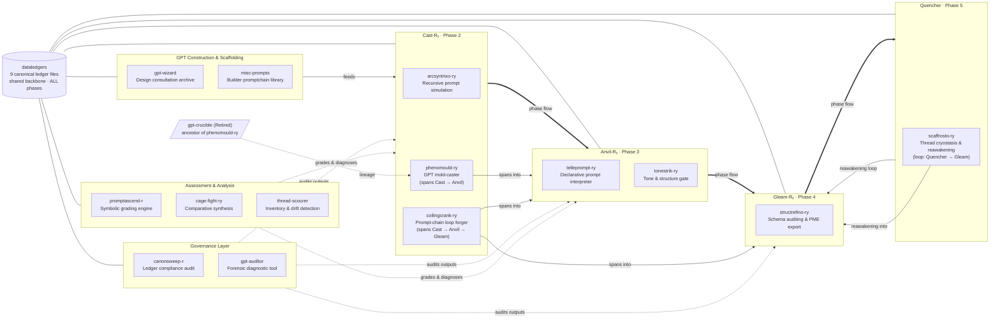

# OverKill Hill FoundRy

**Turn a useful idea into a capability you can keep, inspect, and build on.**

<p align="center">
  <a href="https://okhp3.github.io/overkill-hill-foundry/">
    
  </a>
</p>

<p align="center">
  <strong><a href="https://okhp3.github.io/overkill-hill-foundry/">Open FoundRy</a></strong>
  &nbsp; · &nbsp;
  <a href="https://okhp3.github.io/overkill-hill-foundry/#creator">Custom GPT studio</a>
  &nbsp; · &nbsp;
  <a href="docs/capability-workbench.md">Workbench guide</a>
  &nbsp; · &nbsp;
  <a href="https://okhp3.github.io/skillz/">Explore Skillz</a>
</p>

[](https://github.com/OKHP3/overkill-hill-foundry/actions/workflows/governance.yml)
[](https://github.com/OKHP3/overkill-hill-foundry/actions/workflows/pages.yml)
[](LICENSE)

Bring the idea. Work the contract. Keep the source.

FoundRy is the OverKill Hill P³ capability workbench: a browser-local workshop for
**portable Agent Skills and plans for their host-specific plugins and connectors**,
with prompt, workflow, software starter and retained Custom GPT authoring.
Give an idea a purpose, define what goes in and what comes out, record the evidence,
and leave with a portable source package. Your work stays in your browser until you
export it.

[What you can build](#what-you-can-build) · [Start a project](#start-a-project) ·
[Brand and sharing assets](#brand-and-sharing-assets) · [Run locally](#run-it-locally) ·
[Capability catalog](#capability-catalog) · [Project guide](#project-guide)

Start with a new capability, an existing skill, or a preserved Custom GPT.
Record the source inventory, behavior map, semantic losses, tool requirements,
and compatibility evidence. Packaging plans require implementation and testing
in each destination host. See the [portable skill direction](docs/portable-skill-foundry.md)
and [capability project home](capabilities/README.md).

## What you can build

| Bring to the bench | Take away |
| --- | --- |
| **A reusable prompt** | Instructions with a defined purpose, input/output contract, and validation notes. |
| **An Agent Skill** | A `SKILL.md` starter and supporting source, ready to inspect and test in its destination. |
| **A repeatable workflow** | A portable plan with steps, constraints, and handoff material. |
| **A software idea** | A runnable JSON contract-inspector starter to extend for your own requirements. |
| **A Custom GPT concept** | A specification built through the original nine-station studio, from Brief through Ship. |

The workbench keeps named projects, supports duplication, previews generated files,
and exports source ZIPs. Workspace backups let you move work between browsers or
recover it later. The Custom GPT studio retains its own projects and backups.

## Start a project

1. **Brief:** choose a capability type and name its purpose, audience, owner, and version.
2. **Contract:** define inputs, outputs, constraints, and observable acceptance criteria.
3. **Build:** write the method and components; reference useful packages from Skillz.
4. **Validate:** record what you tested, what happened, and what remains uncertain.
5. **Package:** inspect the files and download your source ZIP.

**No account or provider key is needed.** The authoring path makes no paid model
calls and does not send project text to an AI service. It loads external fonts.
Browser storage belongs to the current site and device; export a workspace backup
before clearing browser data or moving to another device.

See the [complete workbench guide](docs/capability-workbench.md) for imports,
recovery, storage limits, and the separate Custom GPT workflow.

## What the workbench verifies

FoundRy checks structure and records your evidence. Generated starters, completed
fields, and authored acceptance criteria do not establish tested behavior. Test the
exported capability in its intended environment before relying on it. The workbench
does not execute agents, schedule workflows, publish to Skillz, or synchronize
projects across devices.

The [dated maturity assessment](docs/capability-workbench-maturation.md) and
[implementation plan](docs/foundry-implementation-plan.md) explain the evidence and
remaining work. Workflow badges above link to current run results; historical test
counts in documents describe the revision tested.

## Brand and sharing assets

The forge carries through the README, browser tab, home-screen shortcut, and link
preview. The launch link opens the workbench; the artwork above links there too.

| Surface | Assets and configuration |
| --- | --- |
| **README and social cards** | [Forge artwork](artifacts/custom-gpt-creator/public/assets/foundry-social-preview.jpg), shared by this README and the Open Graph / X card tags. |
| **Browser tabs** | [SVG anvil](artifacts/custom-gpt-creator/public/favicon.svg), plus [16 px](artifacts/custom-gpt-creator/public/assets/icons/favicon-16.png) and [32 px](artifacts/custom-gpt-creator/public/assets/icons/favicon-32.png) PNG favicons. |
| **Apple home screen** | [180 px touch icon](artifacts/custom-gpt-creator/public/assets/icons/apple-touch-icon.png). |
| **App shortcuts** | [192 px](artifacts/custom-gpt-creator/public/assets/icons/icon-192.png) and [512 px](artifacts/custom-gpt-creator/public/assets/icons/icon-512.png) icons in the [web manifest](artifacts/custom-gpt-creator/public/manifest.webmanifest). |
| **Pinned tabs and tiles** | [Safari mask icon](artifacts/custom-gpt-creator/public/safari-pinned-tab.svg) and [Windows tile image](artifacts/custom-gpt-creator/public/assets/icons/mstile-150x150.png). |
| **Search and link metadata** | [Application HTML](artifacts/custom-gpt-creator/index.html): title, description, canonical URL, theme color, Open Graph, X card, and structured application data. |

Shortcut support depends on the browser; the manifest does not promise offline
operation. See [the asset guide](docs/brand-and-sharing-assets.md) for provenance,
preview behavior, and GitHub's separate repository social-preview setting.

## Run it locally

Use **Node 22 or newer** and the **pnpm version pinned in `package.json`**.

```bash
pnpm install --frozen-lockfile
pnpm --filter @workspace/custom-gpt-creator run dev
```

Open [localhost:20017/custom-gpt-creator/](http://localhost:20017/custom-gpt-creator/).
These defaults come from the repository's artifact configuration and work in
PowerShell as well as a Unix shell.

Useful checks:

```bash
python3 scripts/governance-check.py
python3 scripts/normalize_filenames.py . --recursive --ascii-only --include-dirs
pnpm run test:capability
pnpm run typecheck
pnpm --filter @workspace/custom-gpt-creator run test:pages-base-path
```

On Windows, use `py` if `python3` is unavailable. The [validation guide](docs/capability-workbench.md#validation)
also covers browser tests and deployment configuration.

The app uses React, TypeScript, and Vite. Its deployment entry is
[`artifacts/custom-gpt-creator/`](artifacts/custom-gpt-creator/); the canonical
workbench implementation lives in [`artifacts/mockup-sandbox/src/`](artifacts/mockup-sandbox/src/).
Canvas previews remain part of that workspace. The API and database packages are
not part of the browser-local authoring path.

## A workbench and a governance relay

FoundRy also maintains the scaffolds, schemas, registry, and working practices
that help OverKill child repositories start with a durable foundation.

```text
OKHP3/OverKill-Hill
  → OKHP3/overkill-hill-foundry
    → foundry-*, vault-*, article-*, narrative-*, mermaid-*, mac-studio-* child repos
```

| Location | Purpose |
| --- | --- |
| [`_template/`](_template/) | Deployable child-repository starter scaffold. |
| [`registry/`](registry/) | Child-repository catalog and relationships. |
| [`schemas/`](schemas/) | Manifest and registry contracts. |
| [`docs/`](docs/) | Relay design, governance, research, and migration guidance. |
| [`.github/`](.github/) | Validation, deployment, workflows, and issue templates. |

**One region, distinct applications.** This FoundRy serves OverKill. AskJamie and
Glee-fully own separate FoundRys; [Skillz](https://okhp3.github.io/skillz/) is their
shared catalog. FoundRy supplies the initial mentor pattern, and improvements can
flow between siblings through review. Universal governance originates in
[OverKill-Hill](https://github.com/OKHP3/OverKill-Hill). See the
[mentoring model](docs/foundry-mentoring-model.md).

**Public by intent, with release boundaries.** The owner confirmed FoundRy's public
status on September 7, 2026. This does not approve private inputs for publication.
ReFolDec is a FoundRy-hosted fold / unfold / refold capability, with publicly
readable scaffolds here; a separate public ReFolDec release still needs its own
approved surface and graduation checks. FoundRy remains this repository's identity.

The [OverKill Hill website](https://overkillhill.com/) owns the brand, portfolio,
and [published MurderBird story](https://overkillhill.com/writings/murderbird/).
MurderBird creative assets and its interactive app belong in
[`murderbird-uncaged`](https://github.com/OKHP3/murderbird-uncaged); the website keeps
its editorial publication and distribution copies. See
[repository boundaries](docs/repository-boundaries.md).

## Capability catalog

Sixteen retained capability folders document the FoundRy lineage: prompt forging,
GPT construction, validation, assessment, and shared ledgers. Their historical
**Active** labels mean maintained material, not verified executable services.

<details>
<summary><strong>Explore the pipeline, tool documentation, and full capability catalog</strong></summary>

### Pipeline Diagram


```mermaid
flowchart LR
    DL[("dataledgers\n9 canonical ledger files\nshared backbone · ALL phases")]

    subgraph CAST["Cast-Rᵧ · Phase 2"]
        ARC["arcsyntrixo-ry\nRecursive prompt simulation"]
        PHE["phenomould-ry\nGPT mold-caster\n(spans Cast → Anvil)"]
        COIL["coilingcrank-ry\nPrompt-chain loop forger\n(spans Cast → Anvil → Gleam)"]
    end

    subgraph ANVIL["Anvil-Rᵧ · Phase 3"]
        TEL["telleprompt-ry\nDeclarative prompt interpreter"]
        TON["tonestrik-ry\nTone & structure gate"]
    end

    subgraph GLEAM["Gleam-Rᵧ · Phase 4"]
        STR["structrefino-ry\nSchema auditing & PME export"]
    end

    subgraph QUENCH["Quencher · Phase 5"]
        SCAF["scaffrosto-ry\nThread cryostasis & reawakening\n(loop: Quencher → Gleam)"]
    end

    subgraph GOV["Governance Layer"]
        CAN["canonsweep-r\nLedger compliance audit"]
        AUD["gpt-auditor\nForensic diagnostic tool"]
    end

    subgraph BUILD["GPT Construction & Scaffolding"]
        WIZ["gpt-wizard\nDesign consultation archive"]
        MIS["misc-prompts\nBuilder promptchain library"]
    end

    subgraph ASSESS["Assessment & Analysis"]
        PRA["promptascend-r\nSymbolic grading engine"]
        CAG["cage-fight-ry\nComparative synthesis"]
        THR["thread-scourer\nInventory & drift detection"]
    end

    ARCH[/"gpt-crucible (Retired)\nancestor of phenomould-ry"/]

    DL --- CAST
    DL --- ANVIL
    DL --- GLEAM
    DL --- QUENCH
    DL --- GOV
    DL --- BUILD
    DL --- ASSESS

    CAST ==>|"phase flow"| ANVIL ==>|"phase flow"| GLEAM ==>|"phase flow"| QUENCH
    QUENCH -->|"reawakening loop"| GLEAM
    PHE -->|"spans into"| ANVIL
    COIL -->|"spans into"| ANVIL
    COIL -->|"spans into"| GLEAM
    SCAF -->|"reawakening into"| GLEAM

    BUILD -->|"feeds"| CAST
    GOV -. "audits outputs" .-> CAST
    GOV -. "audits outputs" .-> ANVIL
    GOV -. "audits outputs" .-> GLEAM
    ASSESS -. "grades & diagnoses" .-> CAST
    ASSESS -. "grades & diagnoses" .-> ANVIL

    ARCH -. "lineage" .-> PHE
```

**Phase guide:** **Cast-Rᵧ (Phase 2)** is where raw prompt ideas are stress-tested, mold-cast into schema-bound GPT forms, and looped through clause-chain forging — surviving prompts leave this phase structurally sound. **Anvil-Rᵧ (Phase 3)** hammers surviving prompts into declarative, ledger-routable form: tone is gated, logic is separated from payload, and outputs are validated for fidelity before advancing. **Gleam-Rᵧ (Phase 4)** polishes and audits prompt structure against canonical schemas, runs final simulations, and seals outputs into PME-ready export packages. **Quencher (Phase 5)** freezes completed GPT thread state into reawakening capsules, preserving everything built so far and generating amplified ghost-versions that can be thawed back into Gleam-Rᵧ for further refinement.

**Jump to tool docs:**

| Tool | Docs |
|---|---|
| dataledgers | [README](dataledgers/README.md) |
| arcsyntrixo-ry | [README](arcsyntrixo-ry/README.md) |
| phenomould-ry | [README](phenomould-ry/README.md) |
| coilingcrank-ry | [README](coilingcrank-ry/README.md) |
| telleprompt-ry | [README](telleprompt-ry/README.md) |
| tonestrik-ry | [README](tonestrik-ry/README.md) |
| structrefino-ry | [README](structrefino-ry/README.md) |
| scaffrosto-ry | [README](scaffrosto-ry/README.md) |
| canonsweep-r | [README](canonsweep-r/README.md) |
| gpt-auditor | [README](gpt-auditor/README.md) |
| gpt-wizard | [README](gpt-wizard/README.md) |
| misc-prompts | [README](misc-prompts/README.md) |
| promptascend-r | [README](promptascend-r/README.md) |
| cage-fight-ry | [README](cage-fight-ry/README.md) |
| thread-scourer | [README](thread-scourer/README.md) |
| gpt-crucible | [README](gpt-crucible/README.md) |

### Core Data Layer

The shared persistent memory backbone. Every tool in every other group reads from and writes to this layer.

| Folder | Purpose | Phase | Status |
|---|---|---|---|
| [dataledgers](dataledgers/README.md) | Nine canonical ledger files (`dataLedger_*_v3.md`) that serve as shared state across all threads, GPTs, and tools — registry, persona, system, parameters, narrative, hydration, processing, ideation, and archive | ALL phases | Active |

---

### Forge Pipeline Tools

Phase-ordered tools that carry a prompt from raw ideation through canon-sealed export. Each tool owns a specific phase of the GPT Found‑Rᵧ six-phase lifecycle.

| Folder | Purpose | Phase | Status |
|---|---|---|---|
| [arcsyntrixo-ry](arcsyntrixo-ry/README.md) | Recursive prompt simulation and survivability engine — runs prompts through a multi-agent entropy loop and selects outputs that survive structural chaos | Cast-Rᵧ (Phase 2) | Active |
| [coilingcrank-ry](coilingcrank-ry/README.md) | Prompt-chain loop forger and clause routing orchestrator — governs linking, tagging, and ledger routing of clause chains under structural tension | Cast-Rᵧ → Anvil-Rᵧ → Gleam-Rᵧ | Active |
| [telleprompt-ry](telleprompt-ry/README.md) | Declarative prompt interpreter — exports prompt logic to dual YAML + Markdown with zero drift; rebuilds faithfully from exports for ledger routing | Anvil-Rᵧ (Phase 3) | Active |
| [tonestrik-ry](tonestrik-ry/README.md) | Tone and structure quality gate — five-stage prompt validator that segments logic from payload, compares variants, audits fidelity, and seals outputs with PME lock | Anvil-Rᵧ (Phase 3) | Active |
| [structrefino-ry](structrefino-ry/README.md) | Schema auditing, prompt scaffolding, simulation, and PME-ready export engine — structural memory made executable at the refinement and polish stage | Gleam-Rᵧ (Phase 4) | Active |
| [scaffrosto-ry](scaffrosto-ry/README.md) | GPT thread cryostasis and reawakening engine — freezes full thread state into hydration capsules, interrogates what was built, and generates an amplified ghost-version for superior reawakening | Quencher → Gleam-Rᵧ | Active |

---

### GPT Construction & Scaffolding Tools

Tools for designing, building, and maintaining Custom GPTs from concept to published deployment.

| Folder | Purpose | Phase | Status |
|---|---|---|---|
| [gpt-wizard](gpt-wizard/README.md) | Design consultation archive and reference library — contains the Golden Master instruction block template, tier-aware best practices guide, and the architectural design conversation that established the GPT Builder workflow | Reference library | Active |
| [misc-prompts](misc-prompts/README.md) | Ordered 7-block promptchain library (Blocks A–G, ~46 numbered prompts) for constructing Glee-fully Custom GPTs using the Builder v01.5 workflow — from audit launch through PME-locked export bundle | Builder workflow | Active |
| [phenomould-ry](phenomould-ry/README.md) | Active GPT mold-caster — the primary schema-bound tool for constructing Custom GPTs with suffix law, persona overlays, lifecycle tags, and PME-readiness enforced; canonical successor to Crucible | Cast-Rᵧ → Anvil-Rᵧ | Active |

---

### Quality Gates & Compliance

Post-output surveillance and diagnostic tools that verify GPTs and their outputs conform to canonical specifications.

| Folder | Purpose | Phase | Status |
|---|---|---|---|
| [canonsweep-r](canonsweep-r/README.md) | 4+1-step ledger compliance audit routine — scans external GPT threads for misrouted clauses, uncommitted writes, legacy relay drift, and unregistered entities; runs a recovery loop until compliant | Governance layer | Active |
| [gpt-auditor](gpt-auditor/README.md) | Forensic diagnostic tool — 17-section interrogation prompt that forces a clean-room self-disclosure report from any Custom GPT covering identity, capabilities, knowledge files, constraints, and ecosystem linkage | QA layer | Active |

---

### Assessment & Analysis Tools

Tools for evaluating prompt quality, resolving competing versions, and maintaining project-wide inventory hygiene.

| Folder | Purpose | Phase | Status |
|---|---|---|---|
| [promptascend-r](promptascend-r/README.md) | Symbolic promptcraft grading engine — evaluates prompt maturity across three mythic scales (Jedi, Chess, Lexashev), assigns a tier rank, provides growth guidance, and can rewrite toward the next level | Assessment | Active |
| [cage-fight-ry](cage-fight-ry/README.md) | Iterative comparative synthesis methodology — pits two text versions against each other, produces a scored hybrid with operator approval gates, and repeats until a canonical version emerges | Synthesis utility | Active |
| [thread-scourer](thread-scourer/README.md) | ChatGPT project inventory tooling and semantic interference detection research — catalogs all ecosystem projects at multiple detail levels and provides the quality methodology for detecting meaning drift in evolving prompts | Turn Track layer | Active |

---

### Archived / Retired

| Folder | Purpose | Phase | Status |
|---|---|---|---|
| [gpt-crucible](gpt-crucible/README.md) | Original monolithic GPT builder tool — canonical ancestor of PhenoMould-Rᵧ; preserved with full rehydration artifacts and lineage record for traceability of all Crucible-era outputs | Lineage archive | Retired |

</details>

## Project guide

| Looking for… | Start here |
| --- | --- |
| Operating rules and publication gates | [AGENTS.md](AGENTS.md) |
| Architecture and delivery plan | [Implementation plan](docs/foundry-implementation-plan.md) |
| Current-state evidence and limitations | [Maturation assessment](docs/capability-workbench-maturation.md) |
| The wider OverKill / AskJamie / Glee-fully ecosystem | [Seven-element universe research](docs/universe-research.md) |
| Website and workbench alignment | [Parent feature-page parity review](docs/research/foundry-feature-page-parity-review.md) |
| Working across agent hosts | [Collaboration and handoff protocol](docs/agent-collaboration.md) |
| Dependencies and maintenance | [Technology inventory](docs/technology-inventory.md) · [Update plan](docs/technology-update-plan.md) |
| Changes and licensing | [Changelog](CHANGELOG.md) · [Apache 2.0 license](LICENSE) |

Built by [Jamie Hill](https://overkillhill.com/) · **OverKill Hill P³**

*The durable unit is the capability. Keep the source. Improve the craft.*
