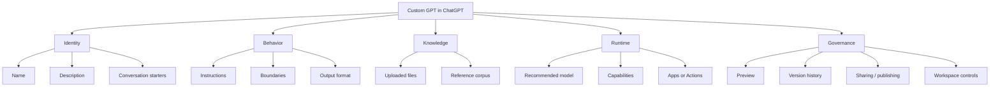
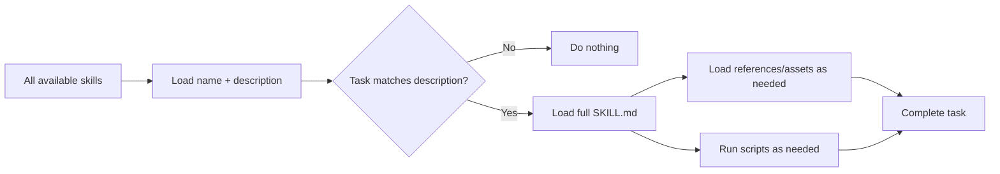
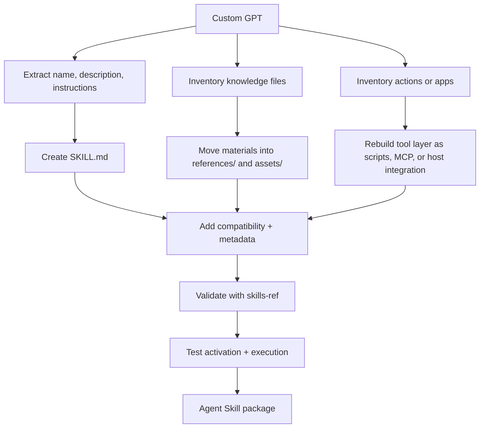

# Custom GPT Construction Standard and Comparison with Agent Skills

## Executive summary

The current OpenAI standard for a **Custom GPT** is not a repo-first artifact or a portable manifest. It is an **editor-defined ChatGPT configuration** composed of a name, description, conversation starters, instructions, optional knowledge files, an optional recommended model, enabled capabilities, and either **apps** or **actions**. OpenAI’s official builder is web-based for paid users, supports built-in preview and version history, and treats instructions as persistent configuration applied to every conversation. Importantly, OpenAI documents an **Instructions** field, not a separately user-editable “system prompt” field; calling a Custom GPT “just a system prompt” is a useful shorthand, but it is not the exact product model. citeturn25view0turn25view1

By contrast, the **Agent Skills** standard is **package-first**. A skill is a directory with a required `SKILL.md` file, plus optional `scripts/`, `references/`, and `assets/` folders. The open spec requires `name` and `description`, supports optional `license`, `compatibility`, `metadata`, and an experimental `allowed-tools` field, and recommends progressive disclosure: load only name/description at discovery time, then load the full `SKILL.md`, then supporting files on demand. This is fundamentally different from a Custom GPT because a skill is a portable filesystem bundle designed for reuse across compatible agent clients. citeturn48view0turn48view1turn49view0

The cleanest mental model is this: **Custom GPTs are curated product configurations inside ChatGPT; Agent Skills are reusable capability packages for agent runtimes**. A strong enterprise operating model therefore separates the two: keep a **repo-side source of truth** for prompt/instruction assets, knowledge assets, OpenAPI schemas, tests, and governance metadata, then publish the ChatGPT-facing GPT from that source. That is also the best bridge toward Agent Skills, because it turns a UI artifact into something you can version, validate, review, and migrate. This same discipline already shows up in the publicly inspectable OKHP3 repositories, which use repo-level `AGENTS.md`, `.agents/`, `skills/`, `scripts/`, audit output folders, and, in AskJamie, a `skills-lock.json` file to operationalize agent behavior and repo hygiene. citeturn8view0turn8view1turn8view2turn9view3turn9view4

The other big conclusion is governance. OpenAI’s GPTs inherit a user-friendly product surface, but external tools introduce obvious security boundaries: apps and actions can send user data to third parties; public GPTs with actions need a valid privacy policy URL; OAuth/API-key auth must be configured carefully; and admins can restrict action domains, app availability, RBAC, and even action parameters in workspace environments. Agent Skills push the problem even farther toward software supply chain governance: untrusted `SKILL.md` files and bundled scripts can carry prompt-injection, exfiltration, and tooling risk, so skills should be treated like installable code, not innocent documentation. citeturn25view1turn27view0turn28view0turn28view1turn29view0turn36view1turn54view6

## What the current Custom GPT standard actually is

OpenAI currently describes GPTs in ChatGPT as **versions of ChatGPT configured for a specific purpose**. A GPT can include instructions, conversation starters, knowledge, selected capabilities, apps, and actions. Builders create and edit GPTs from the GPTs area in ChatGPT, and OpenAI’s current help-center guidance frames the lifecycle as create, configure, test in preview, save, update, version, share, and optionally publish. citeturn25view0turn25view1turn28view0

That “current standard” is therefore **configuration-centric, not file-centric**. There is no official user-authored local manifest format for a Custom GPT comparable to `SKILL.md`. The one major author-visible schema artifact is the **OpenAPI specification** used by GPT Actions. Everything else is configured in the ChatGPT editor UI. That means the real “anatomy” of a Custom GPT is best thought of as a set of editor fields and toggles rather than a portable on-disk package. This is an inference from OpenAI’s builder documentation, which enumerates editor fields but does not expose a corresponding exportable manifest for GPT configuration. citeturn25view0turn27view0

### Anatomy of a Custom GPT

| Component | What OpenAI officially exposes | Why it matters |
|---|---|---|
| Name | User-facing title | Discovery, clarity, trust |
| Description | Short summary | Explains purpose in previews and listings |
| Conversation starters | Example prompts | Onboarding and prompt-shaping for users |
| Instructions | Persistent behavioral guidance | The primary definition of role, workflow, tone, constraints |
| Knowledge | Uploaded files | Reference corpus for domain grounding |
| Recommended model | Suggested starting model | Steers users toward the best fit when options vary |
| Capabilities | Web search, image generation, Canvas, Code Interpreter & Data Analysis, Apps | Extends runtime behavior |
| Actions | OpenAPI-defined external API calls | Enables custom API integrations |
| Version history | Restore earlier versions | Change control and rollback |
| Sharing / publishing | Private, link, workspace, GPT Store | Distribution and governance |

The table above is directly grounded in OpenAI’s current “Creating and editing GPTs,” “GPTs in ChatGPT,” and “Sharing and publishing GPTs” documentation. Two constraints matter operationally: a GPT can use **either apps or actions, but not both at the same time**, and actions/public publishing introduce stricter privacy and policy expectations. citeturn25view0turn25view1turn28view0



In practice, the most misunderstood part of the anatomy is the **Instructions** field. OpenAI says instructions define how the GPT behaves, what it should do, how it should respond, and what it should avoid, and that these instructions apply to every conversation. That makes the field functionally similar to a system/developer layer for builders. But the product surface does not expose a first-class “system prompt” editor. For enterprise design work, it is more accurate to say: **the Instructions field is the builder-controlled behavioral contract**. citeturn25view0

### Knowledge, capabilities, and tools

OpenAI’s current documentation draws a bright line between **Instructions** and **Knowledge**. Instructions define behavior; knowledge files provide reference material. Knowledge currently supports up to **20 files**, each up to **512 MB**, with support for common document, spreadsheet, image, text, and code types. OpenAI explicitly recommends using knowledge for reference material and keeping behavioral rules in instructions instead. It also recommends text-forward files and testing knowledge use in preview. citeturn25view0

Capabilities are the current built-in extension surface. OpenAI lists **web search**, **image generation**, **Canvas**, **Code Interpreter & Data Analysis**, and **Apps**. Apps are user-connected tools and services. Actions are different: they are builder-defined API integrations driven by an OpenAPI schema. OpenAI explicitly says a GPT can use either **apps** or **actions**, but not both. citeturn25view0turn25view1

The “apps” side has been moving closer to the broader OpenAI app/MCP ecosystem. OpenAI’s app docs say custom apps are built using **MCP**, that the **Apps SDK** is the recommended packaging route for app experiences, and that workspace admins can control app availability, write actions, RBAC, connected-account domains, sync, and parameter constraints. That matters because in modern OpenAI terminology, “connector,” “app,” and “MCP-backed tool surface” are now interrelated concepts rather than isolated product lines. citeturn28view1turn31view0turn54view5turn54view6

## How to build a strong Custom GPT

A strong Custom GPT is built the same way a good software product is built: define the job, constrain the scope, choose the minimum viable tool surface, structure the source material, test predictable failure modes, then publish with governance. OpenAI’s own docs stress preview-first testing, tightening instructions before adding more tools, and using explicit multi-step structures and concrete examples in instructions. Anthropic’s public Skill-creation guidance, while about Skills rather than GPTs, lands on the same engineering truth: strong activation depends on a precise name/description, and strong execution depends on structured, scannable, actionable instructions. citeturn25view0turn20view2turn19view5

### A practical build workflow

A rigorous Custom GPT build workflow looks like this:

1. **Define the operating envelope.** Write the single sentence that answers: *What is this GPT for, for whom, and what should it refuse or delegate?* If you cannot define that sharply, the GPT is not ready. OpenAI’s guidance on instructions rewards positive, concrete rules and examples of acceptable and unacceptable outputs. citeturn25view0

2. **Design the interaction contract.** Draft the instruction block first, before uploading files or enabling tools. Put role, goals, decision rules, output shape, and refusal boundaries in that order. This follows OpenAI’s advice to use headings, lists, explicit step structure, and concrete guidance. citeturn25view0

3. **Add knowledge only for reference material.** Use files for handbooks, playbooks, product docs, price sheets, policies, code references, glossaries, or branded exemplars. Do **not** bury critical behavioral rules in uploaded files; OpenAI explicitly says those belong in instructions. citeturn25view0

4. **Enable the minimum tool surface.** If you do not need live information, leave web search off. If you do not need calculations, leave Code Interpreter off. If you need enterprise systems already exposed as apps, prefer apps. If you need your own API and deterministic operation IDs, use Actions. Because apps and actions are mutually exclusive, do not mix them conceptually in the design spec. citeturn25view0turn27view0

5. **Preview with a test matrix.** OpenAI says to test with real prompts before sharing or publishing. Anthropic’s skill guide gives a useful pattern: test normal operations, edge cases, and related-but-out-of-scope prompts. That same matrix is exactly right for Custom GPTs. citeturn25view0turn20view3

6. **Publish only after governance checks.** Sharing level, workspace permissions, builder profile, public visibility, privacy-policy requirements for actions, and domain restrictions all matter. In enterprise workspaces, admins and owners can control creation, sharing, third-party access, app usage, and action domain allowlists. citeturn28view0turn29view0

7. **Treat edits as releases.** Use version history, keep a draft-change log outside ChatGPT, and assume actions may need authentication reconfiguration after restores. OpenAI documents version history and notes that restoring an older action-based GPT may require reauth. citeturn25view0

### A high-quality instruction block

OpenAI does not publish a mandatory format for the Instructions field, but its documented recommendations point toward a disciplined structure like the following:

```markdown
## Role
You are the BFS Margin Guard GPT. You help sales and pricing teams analyze quote risk,
margin erosion, discount anomalies, and policy exceptions.

## Primary goals
- Identify pricing and discount risk.
- Explain findings in plain business language.
- Recommend next actions with minimal ambiguity.

## Decision rules
- If the user asks for a pricing decision, first summarize the data you used.
- If required context is missing, ask targeted follow-up questions.
- If the requested action would violate policy, refuse and explain why.

## Source hierarchy
- Use uploaded pricing policy files as the authority for policy rules.
- Use live action data only for current quote/account facts.
- If policy and live data conflict, say so explicitly.

## Output contract
Always produce:
1. Executive summary
2. Evidence used
3. Risks
4. Recommended action
5. Confidence level

## Boundaries
- Do not invent discount approvals.
- Do not provide legal advice.
- Do not override policy without citing the exact policy clause.
```

That block is not an official OpenAI template. It is a best-practice composition that operationalizes OpenAI’s recommendations: explicit step structure, headings, concrete positive instructions, and examples of boundaries. citeturn25view0

### Knowledge-file structure and RAG discipline

OpenAI does **not** publicly document the internal chunking or embedding model used for knowledge files inside Custom GPTs. So the exact retrieval internals of ChatGPT Knowledge are unspecified in the retrieved source set. What OpenAI does document is that knowledge is for reference material, text-forward files work better, and preview testing is essential. Separately, OpenAI’s Retrieval and File Search docs show how retrieval systems benefit from automatic chunking/embedding/indexing, metadata filtering, semantic search, query rewriting, and ranking controls. That does not prove ChatGPT Knowledge uses the same exposed controls, but it is the best public design clue for how to prepare knowledge assets. citeturn25view0turn50view3turn50view5turn50view2

That leads to practical guidance:

- Split files by **topic and authority**, not by arbitrary page count.
- Put stable rules in one file, unstable reference data in another.
- Prefer documents with clear headings, short sections, and low layout noise.
- Use canonical filenames and explicit section titles.
- If you need reliable filters such as “category = policy” or “year = 2026,” a pure Custom GPT Knowledge setup is weaker than an API retrieval layer because OpenAI’s public Retrieval/File Search APIs expose metadata filters and ranking controls that the Custom GPT editor does not. citeturn25view0turn50view2turn50view3

A practical foldering discipline for the content *before* upload looks like this:

```text
knowledge/
  policies/
    discount-policy-2026.md
    approval-matrix-2026.md
  products/
    sku-pricing-reference-q3-2026.csv
    margin-glossary.md
  examples/
    good-quote-review-example.md
    escalation-example.md
```

Again, that is a **recommended governance structure**, not an OpenAI-required upload layout.

### Action and capability examples

If you need a GPT Action, the formal requirement is an OpenAPI schema in JSON or YAML, plus an authentication mode of **None**, **API key**, or **OAuth**. OpenAI says the editor can validate schemas, detect actions, and import schemas by paste or URL. Public GPTs with actions need a **valid Privacy Policy URL**. OAuth setups require client ID/secret, authorization URL, token URL, scope, and redirect URL registration; OpenAI also requires use of the OAuth `state` parameter. citeturn27view0turn52view0turn52view1

A minimal Action fragment for a write operation should mark consequential endpoints:

```yaml
openapi: 3.1.0
info:
  title: Quote Review API
  version: 1.0.0
servers:
  - url: https://api.example.com
paths:
  /quotes/{quoteId}/review:
    post:
      operationId: reviewQuote
      summary: Review a quote and return pricing risk.
      description: Analyze a quote and return policy and margin findings.
      x-openai-isConsequential: true
      parameters:
        - in: path
          name: quoteId
          required: true
          schema:
            type: string
      requestBody:
        required: true
        content:
          application/json:
            schema:
              type: object
              properties:
                policyVersion:
                  type: string
                includeRecommendations:
                  type: boolean
      responses:
        "200":
          description: Review result
```

That `x-openai-isConsequential: true` flag is documented in OpenAI’s GPT Actions production notes for mutating endpoints. OpenAI also documents production constraints that matter in real deployments: TLS 1.2+, port 443, 45-second request timeout, payload size limits, and 429-aware backoff behavior. citeturn52view2

### Design rubric for poor, acceptable, good, and exemplary GPTs

The fastest way to assess design quality is to look at **activation precision**, **instruction clarity**, **grounding quality**, **tool discipline**, and **governance posture**.

| Quality tier | Activation | Instructions | Knowledge / grounding | Tools | Governance |
|---|---|---|---|---|---|
| Poor | Vague name and generic description; triggers unpredictably | Unstructured wall of text; conflicting rules | Random files dumped in; rules hidden in uploads | Too many tools enabled by default | No tests, no version notes, no ownership model |
| Acceptable | Description names the job but not boundaries | Some sections, limited examples | Relevant files present, weak organization | One or two correct tools enabled | Manual preview only |
| Good | Description names capability, triggers, and negatives | Clear sections, output contract, refusal rules, examples | Files are authoritative, scoped, and text-forward | Minimum necessary tool surface | Test matrix, change log, owner, rollback plan |
| Exemplary | Precise activation window with explicit non-goals | Strong decision logic, source hierarchy, error handling, deterministic output patterns | Canonical corpus, stale-data strategy, provenance instructions | Tools separated by risk and necessity; write operations deliberately gated | Versioned source of truth, formal evals, workspace controls, public/private policy aligned |

OpenAI’s own GPT guidance supports the key distinctions here: specific names and descriptions, explicit instructions, use of examples, preview testing, and tightening instructions before expanding tools. Anthropic’s Skill guidance independently reinforces the same design law: the name and description dominate triggering quality, and instructions should be structured, scannable, and concrete. citeturn25view0turn19view5turn20view2

### Twelve concrete example Custom GPTs

The examples below are synthetic designs, but each is aligned to the current OpenAI Custom GPT surface documented in the help center.

| GPT concept | Typical input | Workflow | Output | Required capabilities |
|---|---|---|---|---|
| Margin Guard | Quote, discount request, customer context | Policy check → anomaly detection → recommendation | Executive summary + risk table | Knowledge, optional Actions or Apps |
| Contract Triage | MSA/SOW/NDA upload | Clause extraction → red-flag classification → escalation guidance | Risk memo + clause list | Knowledge, Canvas, optional Code Interpreter |
| Product Config Advisor | SKU/feature need | Requirements normalization → catalog grounding → option match | Suggested bundles + rationale | Knowledge, optional web search |
| Executive Brief Builder | Meeting notes, emails, docs | Source synthesis → audience adaptation → concise brief generation | Board-style memo | Knowledge, Canvas |
| Field Ops Incident Copilot | Site issue report, photos, logs | Incident classification → checklist → escalation path | Structured incident response | Knowledge, image input, optional Apps |
| Procurement Compare | Vendor quotes / sheets | Normalize line items → calculate deltas → summarize tradeoffs | Comparison report + recommendation | Code Interpreter, Knowledge |
| Policy Tutor | User question about handbook/policy | Retrieve relevant section → explain plainly → cite policy section | Answer + policy citation | Knowledge |
| Deal Desk Coach | Discount scenario | Validate against matrix → ask for missing authority → suggest next action | Approval path + rationale | Knowledge, optional Actions |
| Sales Email Rewriter | Draft email + persona | Tone adaptation → compliance/style check → generate variants | Revised email options | Instructions only or Knowledge |
| Project Postmortem Analyst | Timeline, incidents, docs | Causal grouping → evidence mapping → remediation suggestions | Postmortem draft | Knowledge, Canvas |
| Data QA Analyst | CSV/XLSX uploads | Data profiling → anomaly detection → summary | Findings + charts | Code Interpreter |
| API Integration Explainer | OpenAPI spec or docs | Read spec → explain endpoints → generate examples | API summary + example calls | Knowledge, optional Code Interpreter |

The pattern across all twelve is the same: the best GPTs are not “smart generalists with vibes.” They are **narrowly scoped interaction products** with explicit source hierarchy, output contract, and tool boundaries. That is exactly where the OpenAI builder shines, and exactly where sloppy builders fail. citeturn25view0turn25view1

## What Agent Skills are and how the SKILL.md specification works

The current open **Agent Skills** standard defines a skill as a directory containing, at minimum, a `SKILL.md` file. The spec requires YAML frontmatter followed by Markdown instructions and allows optional `scripts/`, `references/`, and `assets/` directories. The required frontmatter fields are `name` and `description`; optional fields are `license`, `compatibility`, `metadata`, and experimental `allowed-tools`. The spec also defines naming constraints, progressive disclosure behavior, file-reference recommendations, and validation via the `skills-ref` reference library. citeturn48view0turn48view1turn49view0

A minimal conformant skill is therefore much more explicit and portable than a Custom GPT. The spec says `name` must be 1–64 characters, lowercase alphanumeric plus hyphens, must not start/end with a hyphen, must not use consecutive hyphens, and must match the parent directory name. `description` must be 1–1024 characters and should describe both what the skill does and when to use it. The spec recommends keeping the main `SKILL.md` under **500 lines**, the instruction body under roughly **5000 tokens**, and file references shallow and relative. citeturn48view1turn49view0

### Core SKILL.md fields

| Field | Required | Purpose |
|---|---|---|
| `name` | Yes | Stable skill identifier; must match folder name |
| `description` | Yes | What the skill does and when to use it |
| `license` | No | Licensing terms or reference |
| `compatibility` | No | Environment/runtime requirements |
| `metadata` | No | Extensible key-value map for client-specific properties |
| `allowed-tools` | No | Experimental pre-approved tools list |

Those constraints come from the current open specification, not from one vendor’s private implementation. citeturn48view1turn49view0

A conformant example looks like this:

```markdown
---
name: quote-review
description: Review sales quotes for margin risk, discount policy exceptions, and escalation needs. Use when working with bids, discounts, quote packages, approvals, or pricing exceptions.
license: Proprietary. See LICENSE.txt.
compatibility: Requires access to pricing spreadsheets and Python 3.11+
metadata:
  owner: revenue-ops
  version: "1.2"
allowed-tools: Read Bash(python:*)
---

## Purpose
Review a quote package and identify the pricing or approval risks.

## Required steps
1. Read the provided quote and pricing references.
2. Compare discount levels to policy thresholds.
3. Flag any missing approvals or unsupported assumptions.
4. Produce a structured report.

## Outputs
- Summary
- Findings
- Risks
- Escalation guidance
```

### Progressive disclosure and why Skills feel different

The spec’s biggest architectural idea is **progressive disclosure**. Agents load only the `name` and `description` of all skills at startup, then load the full `SKILL.md` only for relevant skills, and only then read referenced files or execute scripts as needed. That makes skills cheap to keep around in large numbers and gives them a package-like feel rather than a persistent-config feel. citeturn48view0turn49view0



That progressive disclosure model is visible not only in the spec but also in Claude Code and OpenAI’s own Skills API. Anthropic’s docs explicitly describe skills as loading their bodies only when used, and the Agent Skills overview describes three stages: discovery, activation, and execution. citeturn14view2turn48view0turn49view0

### Claude-specific extensions and OpenAI’s Skills implementation

Anthropic’s current Claude Code docs say Claude Code Skills follow the open Agent Skills standard **and extend it** with fields and features such as `when_to_use`, `argument-hint`, `arguments`, `disable-model-invocation`, `user-invocable`, `context: fork`, `agent`, dynamic context injection with ``!<command>``, and visibility overrides. That means not every field you see in a Claude skill is part of the open spec. citeturn14view2turn16view1turn18view0turn18view1turn18view2turn19view3

OpenAI’s current Skills API, meanwhile, implements skills as **versioned bundles** uploaded to `/v1/skills`, with directory or zip upload, version pointers, and the ability to attach skills to hosted or local shell environments. OpenAI says these skills are compatible with the open Agent Skills standard, requires exactly one `skill.md`/`SKILL.md` per bundle, allows up to **50 MB** zip size, **500 files** per skill version, and **25 MB** max uncompressed file size, and notes that skill instructions are injected as **user prompt input**, not as system prompt input. citeturn36view0turn36view1turn47view0turn47view1

That last point is crucial. In OpenAI’s Skills API, the platform adds each skill’s `name`, `description`, and `path` to prompt context so the model knows the skill exists, and if the model decides to invoke it, it reads the full `SKILL.md`. OpenAI explicitly states that the skill instructions are **user prompt input**. That is a very different control model from a Custom GPT’s persistent instructions. citeturn47view0turn47view1

## Mapping Custom GPTs to Agent Skills and planning migration

The cleanest comparison is to line up **what you are authoring** in each system.

| Custom GPT construct | Closest Agent Skills equivalent | Mapping quality | Notes |
|---|---|---|---|
| Name | `name` | Strong | Both are short identifiers |
| Description | `description` | Strong | Both drive discovery / activation |
| Instructions | `SKILL.md` body | Strong | Both contain the main task logic |
| Conversation starters | No core spec equivalent | Weak | Host UX concern, not skill manifest concern |
| Knowledge files | `references/` and sometimes `assets/` | Partial | GPT knowledge is retrieval corpus; skills references are package files an agent may open |
| Actions via OpenAPI | No core spec equivalent | Weak | Skills spec does not define API schemas; host/tool layer must do that separately |
| Apps / connectors | No core spec equivalent | Weak | Host runtime concern, not skill spec concern |
| Capability toggles | `compatibility` or host-specific config | Partial | Skills describe environment needs; GPTs toggle product-native capabilities |
| Recommended model | None | None | Skills spec is runtime-agnostic |
| Version history | Repo versioning / hosted skill versions | Partial | OpenAI Skills API supports explicit skill versions; Custom GPT version history is product-native |
| Sharing / Store | Repo, registry, or host distribution | Partial | Different distribution models |
| Workspace RBAC / governance | Host-level policy | Partial | Governance is outside the core skills spec |

The point is blunt: **Custom GPTs bundle product behavior, UX, and optional tooling into one ChatGPT object**, while **Agent Skills isolate reusable capability into a portable package and leave more of the runtime and policy surface to the host**. citeturn25view0turn25view1turn48view1turn36view0

### Where the gaps and incompatibilities are

The biggest incompatibilities are structural:

- **No portable GPT manifest:** OpenAI exposes editor fields, not a portable GPT package format. Agent Skills are explicitly package-based. citeturn25view0turn48view1
- **Actions are richer than `allowed-tools`:** GPT Actions carry OpenAPI schemas, operation IDs, auth, and privacy-policy requirements. Agent Skills’ `allowed-tools` is only an experimental pre-approval string, not a tool-schema language. citeturn27view0turn48view1
- **Knowledge behaves differently:** GPT Knowledge is a hosted reference corpus. Agent Skills references are in-package files that agents may or may not open. The retrieval and storage model is different. citeturn25view0turn48view0turn49view0
- **Invocation semantics differ:** In Claude, some skills can be hidden from users or from the model via extension fields; in OpenAI’s Skills API, instructions are user-prompt mounted assets. Custom GPT instructions are persistent config applied to every conversation. citeturn18view0turn18view1turn47view1turn25view0
- **Distribution differs:** GPTs publish through ChatGPT sharing and the GPT Store; Skills distribute through repos, registries, or host-specific APIs/tooling. citeturn28view0turn36view0turn48view0

### How to convert a Custom GPT into an Agent Skill

A workable migration path is:

1. **Freeze the GPT contract.** Export the human-readable source materials: name, description, instructions, conversation starters, action schema, knowledge file list, and test prompts.
2. **Convert identity.** Map GPT name → `name`, GPT description → `description`.
3. **Move instructions.** Flatten the GPT instructions into the `SKILL.md` body. Remove ChatGPT-specific UX language.
4. **Repackage knowledge.** Convert uploaded knowledge into `references/` and `assets/`. Keep the `SKILL.md` body slim and link out.
5. **Rebuild tool access.** If the GPT used Actions, move API invocation logic into either scripts, MCP tools, or the host client’s tool/plugin layer. Do not expect the open spec itself to preserve OpenAPI behavior.
6. **Add compatibility metadata.** Declare runtime dependencies in `compatibility`.
7. **Validate.** Run `skills-ref validate` and test activation behavior. citeturn49view0

### How to convert an Agent Skill into a Custom GPT

The reverse path is also workable, but you lose portability:

1. **Flatten `SKILL.md` into the Instructions field.**
2. **Convert `references/` files into GPT Knowledge uploads** or merge the most important pieces into Instructions if behavior-critical.
3. **Translate scripts** into either GPT Actions, Apps, or a separate external service. GPTs cannot directly carry bundled package scripts the way Skills can.
4. **Author conversation starters** because the skill spec has no equivalent.
5. **Choose capabilities** and, if needed, a recommended model.
6. **Preview and publish** inside ChatGPT with version notes. citeturn25view0turn25view1



## Security, governance, testing, and CI/CD patterns

The security model for Custom GPTs is straightforward but unforgiving. OpenAI says GPT builders **cannot view individual conversations** users have with their GPTs. But if a GPT uses **apps** or **external APIs**, relevant user input may be sent to third parties, users may be prompted for approval, and OpenAI does not audit or control how those third parties store or use the data. That means a GPT is not just a prompt asset; it is a data-routing asset. citeturn25view1

For GPT Actions specifically, OpenAI supports **None**, **API key**, and **OAuth** authentication. API keys are stored encrypted; OAuth supports per-user sign-in and is the recommended path for personalized experiences. OpenAI documents the callback pattern, token handling, and the requirement to use the OAuth `state` parameter. Public GPTs that use actions must include a **valid Privacy Policy URL**. In workspace settings, owners/admins can restrict actions to allowed domains, disable apps for workspace-authored GPTs, and control creation, editing, sharing, and third-party GPT access through RBAC. citeturn27view0turn52view0turn52view1turn29view0

Operationally, GPT Actions should be treated like production APIs. OpenAI’s production notes specify **TLS 1.2+ on port 443**, valid public certificates, 45-second round-trip timeouts, 429-aware backoff behavior, payload limits, and support for marking mutating endpoints as consequential with `x-openai-isConsequential: true`. Those are not nice-to-haves. They are the boundary between a demo and an integration you can trust. citeturn52view2

The risk profile for Agent Skills is harsher because the package itself is executable social context. The Agent Skills spec allows scripts and references; Anthropic warns that Skills give Claude access to execute code; OpenAI warns that skills can introduce prompt-injection-driven exfiltration risk; and OpenAI explicitly recommends **not** exposing an open skill repository directly to consumer end users. On the MCP side, OpenAI recommends official servers when possible, approval review for data sharing, and caution because malicious servers can embed hidden instructions or change tool behavior unexpectedly. citeturn15view0turn36view1turn54view6

### Recommended test cases and automated validation checks

For Custom GPTs, the minimum serious test pack should cover:

- **Happy path activation:** does the GPT respond in the expected style and structure?
- **Boundary path:** does it *not* activate or overreach on adjacent prompts?
- **Knowledge grounding:** can it cite or reference the intended uploaded materials when instructed?
- **Tool gating:** does it avoid unnecessary tool use and does it request/trigger approvals appropriately?
- **Auth failures:** what happens when OAuth is expired, a domain is blocked, or an action returns 401/403/429/500?
- **Mutation safety:** for write endpoints, does the GPT ask, confirm, and explain consequential actions?
- **Adversarial prompts:** prompt injection, instruction override attempts, roleplay jailbreaks, and policy-evasion prompts.
- **Regression pack:** same 20–50 prompts run after every instruction or schema change. citeturn25view0turn20view3turn52view2

For Agent Skills, add package validation and supply-chain checks:

- `skills-ref validate ./my-skill`
- frontmatter linting
- directory-name / `name` parity
- script dependency checks
- secret scanning
- license presence checks
- compatibility assertions
- policy scanning for unsafe instructions or destructive default workflows. citeturn49view0turn36view1

### Suggested repo layout

OpenAI does not require a local repo manifest for Custom GPTs, but teams absolutely should maintain one. A practical layout that supports **both** Custom GPTs and Agent Skills looks like this:

```text
ai/
  custom-gpts/
    margin-guard/
      README.md
      instructions.md
      description.md
      conversation-starters.md
      knowledge/
        policies/
        examples/
      actions/
        openapi.yaml
        auth-notes.md
      evals/
        happy-path.yaml
        edge-cases.yaml
        adversarial.yaml
      changelog.md
      ownership.yaml
  skills/
    margin-guard/
      SKILL.md
      references/
        pricing-policy.md
        approval-matrix.md
      scripts/
        review_quote.py
      assets/
        report-template.md
  shared/
    policy/
    glossaries/
    test-fixtures/
  .github/
    workflows/
      validate-ai.yml
```

That pattern is not hypothetical. The public OKHP3 repos you named already lean in this direction: `.agents/` for agent state, `skills/`, `scripts/`, `assets/audit/`, repo-level `AGENTS.md`, and `skills-lock.json` in AskJamie are exactly the kinds of operational mechanisms that make AI assets governable. citeturn8view0turn8view1turn8view2turn9view3turn9view4

A thin CI workflow is enough to get real value:

```yaml
name: validate-ai-assets

on:
  pull_request:
  push:
    branches: [main]

jobs:
  validate:
    runs-on: ubuntu-latest
    steps:
      - uses: actions/checkout@v4

      - name: Validate Agent Skills
        run: |
          pip install skills-ref || true
          for d in ai/skills/*; do
            [ -d "$d" ] && skills-ref validate "$d" || true
          done

      - name: Lint OpenAPI
        run: |
          npm install -g @redocly/cli
          find ai/custom-gpts -name "openapi.yaml" -exec redocly lint {} \;

      - name: Secret scan
        run: |
          pip install detect-secrets
          detect-secrets scan --all-files

      - name: Prompt regression placeholder
        run: |
          echo "Run scripted preview/eval prompts here"
```

The point is not to over-engineer. The point is to prevent silent drift between what the GPT does in ChatGPT and what your source-of-truth assets say it is supposed to do.

## Comparative taxonomy including Gemini Gems, Copilot declarative agents, and adjacent AI terms

Because your original question asked for contrast across adjacent concepts, the most useful comparison is to sort the field by **artifact type**.

| Term | What it is | Artifact type | Closest relation to a Custom GPT |
|---|---|---|---|
| Prompt | A single instruction or input | One-off text input | Rawest building block |
| Chat | A conversation instance | Runtime interaction | A GPT can be used inside chats |
| Thread / conversation state | A stateful conversation object in APIs | Runtime state container | Not a reusable assistant definition |
| Project | Workspace/grouping concept | Organizational container | Holds work; not the assistant itself |
| Connector / app | A tool surface into external services | Tool integration | Can extend a GPT’s runtime |
| Action | OpenAPI-based API integration | Tool manifest + auth config | Extends GPT with custom API calls |
| MCP server | External tool/data protocol endpoint | Runtime integration protocol | Increasingly the substrate for apps/connectors |
| RAG / retrieval | Grounding pattern over indexed corpora | Retrieval architecture | One way to power knowledge-backed assistants |
| Agent | An application that plans, uses tools, and keeps state | Runtime application | Broader and more autonomous than a GPT |
| Skill | Reusable capability package | Portable package | Closest package-level cousin to a GPT |
| Custom GPT | Configured ChatGPT experience | Product configuration | ChatGPT-native assistant artifact |

OpenAI’s current API docs define **agents** as applications that plan, call tools, collaborate across specialists, and keep enough state to complete multi-step work. OpenAI’s conversation-state docs distinguish long-running conversation objects from assistant definitions. OpenAI’s MCP/connectors docs define connectors as OpenAI-maintained MCP wrappers and remote MCP servers as general protocol endpoints. OpenAI’s retrieval docs position vector stores, automatic chunking/embedding/indexing, metadata filtering, and query rewriting as retrieval architecture concerns. citeturn54view3turn54view0turn54view5turn54view6turn50view3turn50view5

### Custom GPTs versus Gemini Gems and Copilot declarative agents

The shortest honest comparison is this:

| System | Primary authoring surface | Knowledge model | Tool model | Packaging model | Openness |
|---|---|---|---|---|---|
| OpenAI Custom GPT | ChatGPT editor | Uploaded knowledge files | Built-in capabilities plus Apps **or** Actions | Product configuration | Closed/editor-defined |
| Google Gemini Gem | Gemini UI / Workspace side panel | Custom instructions plus uploaded files | Gemini/Workspace-integrated capabilities | Product configuration | Closed/UI-defined |
| Microsoft 365 Copilot declarative agent | Agent Builder, Copilot Studio, Agents Toolkit, SharePoint | Microsoft 365 data + connectors + uploaded files | Actions/plugins, potentially multiple plugins | App/agent definition | Platform-defined, enterprise-oriented |
| Agent Skill | Filesystem package with `SKILL.md` | In-package references/assets | Scripts and host tool layer | Portable package | Open standard |

OpenAI’s GPT docs and Microsoft’s declarative-agent docs support a clear contrast: both are **platform-native configured assistants** that ride on the host orchestrator, models, and policy plane, while Agent Skills are **host-portable capability bundles**. Microsoft explicitly says declarative agents are instructions + actions + knowledge + app metadata running on Microsoft 365 Copilot’s orchestrator and models, with enterprise security/compliance controls and plugin support. citeturn25view0turn25view1turn45view1turn45view3

For Google Gemini Gems, the public source set available in this session was thinner and more sign-in-gated than OpenAI’s and Microsoft’s. The strongest accessible evidence was coverage of Google’s Workspace rollout stating that Gems are customizable Gemini assistants, can include uploaded files, are available in Workspace side panels, and are created in Gemini rather than through a portable open package format. I would treat the Google row as directionally reliable but less fully documented here than the OpenAI/Microsoft/Agent Skills rows. citeturn41news0turn43view1

## Open questions and limitations

A few points remain intentionally bounded rather than overclaimed.

First, OpenAI does **not** publicly document the exact chunking, embedding, ranking, or filtering internals used by **Custom GPT Knowledge**. The guidance in this report on file structuring is therefore based on OpenAI’s explicit GPT Knowledge recommendations plus the publicly documented behavior of OpenAI Retrieval/File Search, not on a published internal Custom GPT Knowledge spec. citeturn25view0turn50view3turn50view5

Second, only a subset of the GitHub repositories you listed were publicly inspectable in this session. The repo observations in this report therefore rely on the accessible public views of **OverKill-Hill**, **mermaid-theme-builder**, **Glee-fullyTools**, and **AskJamie**, not on a full inspection of every listed repository. The patterns observed there were still useful and concrete. citeturn8view0turn8view1turn8view2turn9view3turn9view4

Third, Microsoft’s Learn pages for declarative agents exposed enough high-level content for architectural comparison, but parts of that documentation were authorization-gated. Likewise, public Gemini Gem documentation was less directly accessible than OpenAI’s help-center material and the Agent Skills spec. Where those ecosystems were less transparent in the accessible source set, I kept the comparison at the correct level of confidence rather than pretending the source base was deeper than it was. citeturn45view1turn45view3turn41news0

The practical takeaway is still clear. If you want a **current-standard Custom GPT**, build a disciplined ChatGPT configuration with sharp instructions, curated knowledge, minimal tools, preview-based testing, and explicit governance. If you want something **portable, versionable, auditable, and cross-runtime**, treat that GPT as one deployment target of a broader **skills-as-code** source-of-truth model based on `SKILL.md`-style packaging and repo-first lifecycle management. That is the least fragile architecture available in the current ecosystem. citeturn25view0turn48view1turn36view0