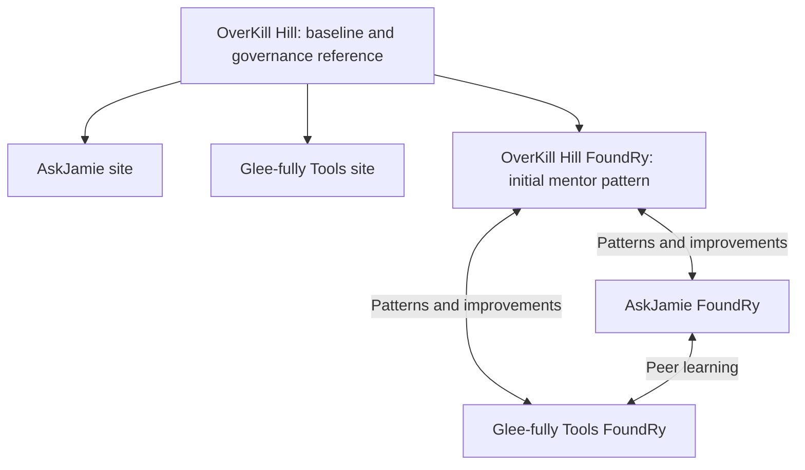

# FoundRy mentoring model

Owner clarification: September 7, 2026. This records intended relationships and
supersedes earlier statements that the OverKill Hill FoundRy must remain private.
GitHub metadata was rechecked and confirms this repository is public.

## Baseline and distinct ownership

OverKill Hill is the centroid of the universe. AskJamie and Glee-fully are distinct
sites that borrow baseline patterns from OverKill Hill and defer to it when a
shared governance question needs resolution. Skillz is the shared skill catalog.

The same pattern applies to the FoundRys. OverKill Hill FoundRy serves the OverKill
region and provides the initial mentor pattern for AskJamie FoundRy and Glee-fully
Tools FoundRy. Each keeps its own audience, voice, application, project data, and
implementation choices. Mentoring does not require a shared runtime or turn the
sibling applications into features of this workbench.

## Learning in every direction

Either sibling can improve the mentor or the other sibling. A useful pattern
can originate anywhere: for example, a better backup flow in AskJamie FoundRy or
a clearer authoring method in Glee-fully Tools FoundRy may be adopted by OverKill
FoundRy and then reused elsewhere. These are examples, not claims of completed
cross-repository adoption.

For an adopted improvement, record its source and purpose, preserve any regional
adaptation, and review it in the receiving repository. Changes to universal rules
are reconciled in OverKill-Hill so the baseline remains authoritative. Local
implementation improvements need not wait for universal standardization. The
registry's `parent_foundry` records baseline lineage, not application ownership
or a prohibition on learning from a sibling.

## Public repository, explicit releases

OverKill Hill FoundRy is intentionally public. The root manifest now reflects
that owner decision; the former permanent-private lock and employer-isolated
repository classification no longer describe this repository. Source and license
review requirements remain in place. This clarification is not evidence that a
new PII, employer, or source audit was performed.

Checked-in capability scaffolds, including ReFolDec, are publicly readable. A
separate capability release still requires its graduation checks and approved
publication surface. Private Notion pages, client/employer material and private
sibling sources are not made publishable by this repository's visibility.

Dated maturity and transfer records retain historical claims with a supersession
notice. The frozen `maturity-baseline-v0-1.json` remains evidence about its recorded
revision, not current visibility policy. Sibling repositories are not changed by
this record, and their visibility must be established independently.
