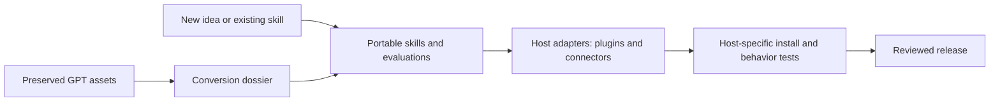

# Portable skills and platform packages

Owner direction: 2026-09-27. OverKill FoundRy (OKHP3 FoundRy), Glee-fully Tools
FoundRy (Glee-fully Personalizable Tools FoundRy) and AskJamie FoundRy are intended
to evolve from GPT-building workshops into skill and integration workshops.
This change implements the foundation in OverKill FoundRy only. Each sibling
retains its application, audience and project ownership. Skillz remains the shared
catalog; universal governance originates in OverKill-Hill.

## Product model

The durable product is a capability with one or more composable Agent Skills.
Prompts, references, scripts, schemas and evaluation cases support that method.
Plugins package skills with target-host configuration; connectors implement
tool/data access, potentially using MCP, APIs or an application's integration
mechanism. A connector is not produced simply by renaming a skill.



Source portability is the goal. ChatGPT/Codex, Claude, OpenClaw, Perplexity and
other hosts are possible targets, with support **unverified** until each host's
current capabilities, package format, permissions and execution have been checked.
Maintain a manual-use fallback or record unsupported behavior when a host cannot
load a skill or use its tools. Do not claim universal runtime compatibility.

## Capability subtree contract

```text
capabilities/<stable-capability-slug>/
  README.md                  Purpose, audience, current maturity and entry points
  capability.json            Authored contract and bounded readiness
  AGENTS.md                  Local contributor rules and parent lineage
  origin/source.json         Repository/export identity, revision and rights review
  origin/                    Reviewed source snapshots and provenance manifests
  skills/<skill-name>/SKILL.md
  skills/<skill-name>/references/, scripts/, assets/  As needed
  adapters/compatibility.json Requested and verified hosts with evidence
  adapters/<host>/            Implemented host packaging; no credentials
  docs/conversion.md          Behavior map, loss register and disposition
  docs/validation.md          Observed results and unresolved gaps
  tests/                     Portable behavior and adapter evaluation cases
```

Use capability names instead of platform names for new products. Keep historical
brand names and repository aliases in provenance. The exact `SKILL.md` name is a
tool convention; surrounding paths use lowercase ASCII kebab case. Different
skills may share a capability but must have distinct names and scope. Host
packages reference the canonical skill or use a reproducible copy with recorded
revision; hand-edited divergent copies are not canonical.

Browser exports supply source and planning records, not a complete release. Before
release, add reviewed licenses/notices, real tests and implemented adapters as
needed. Existing version-1 browser backups remain readable. New source packages
use `skills/<name>/SKILL.md` instead of the old `skill/SKILL.md`; stored project
identities and the separate `cgpt-workspace` are preserved.

## Conversion gates

1. Inventory supplied instructions, knowledge, actions/apps, starters, examples
   and evaluations. Label each available, partial, missing or unverified. Preserve
   original bytes and attribution where source rights allow.
2. Map every behavior to a skill procedure, reference, script, adapter, explicit
   drop or blocker. Record retrieval, memory, authentication and other semantic
   losses with impact, mitigation and observable tests.
3. Author and evaluate small skills using the conversion-planning and
   skill-foundry contributor skills. Include semantic preservation, adapter/loss
   and boundary cases; compare observed results with the supplied source behavior.
4. Package each chosen host independently. Record tool contracts, auth method,
   minimum permissions, side effects, dependencies and unavailable-tool recovery.
5. Record host/version, source revision, test date, fixtures, actual result and
   evidence for installation, behavior and removal. A checked review box is only
   an owner assertion. A manifest or authored test is not an executed result.
6. Apply source/license, privacy, employer/conflict and publication graduation
   checks before release. Public repository visibility does not clear source rights.

## Importing existing product repositories

The new namespace supports consolidation; it does not mean every governed child
repository belongs here. Import GPT product projects assigned to OverKill, not
the public website, MurderBird, sibling FoundRys or unrelated governed children.

1. Inspect the exact source repository, visibility, license, branches, tags and
   uncommitted work. Assign a regional owner and destination slug. Record the
   source URL, pinned commit, proposed destination and status `planned` in
   `registry/capability-migrations.json`. No guessed repository mappings.
2. Preserve recoverable source history and a file/hash inventory. Review the
   entire history before a Git subtree import: a public FoundRy would expose
   imported history, including old private files. If history is unsafe, retain
   it privately and use a reviewed source snapshot with hashes and attribution.
3. Use one integration branch. A Git subtree import is an intentional history
   operation; a copied folder is a snapshot, not a history-preserving subtree.
   Do not nest `.git` directories or use a submodule as a substitute. Preserve
   source licenses and dates. Do not overwrite an existing destination.
4. Verify file and hash parity, explain exclusions, repair links, and run the
   governance suite and applicable product tests. Mark `imported` only with a
   destination and import evidence. Mark `converted` or `validated` separately.
5. Update `registry/index.yaml` relationships and the migration record. Keep
   source repositories available until parity and recovery are proven; archival
   and redirects are separate closeout actions. Do not auto-delete old projects.

The initial migration registry is empty intentionally: the new direction names
the three FoundRys but does not identify each external GPT repository or its
regional destination. The 16 legacy source folders in README are an existing
local catalog, not a verified external repository migration inventory.

Migration records use these fields (illustrative only; do not enter a placeholder
repository in the live registry):

```json
{
  "slug": "capability-name",
  "owner": "Named migration owner",
  "source": "Exact source repository URL or local path",
  "source_revision": "Pinned commit or export checksum",
  "destination": "capabilities/capability-name",
  "import_method": "reviewed-snapshot",
  "status": "planned"
}
```

Allowed import methods are `git-subtree`, `reviewed-snapshot`, and `local-move`.
After import, add `import_evidence`, `source_review`, and `license_review` references.
`converted` additionally requires a named skill; `validated` requires a
`validation_evidence` reference. The governance audit checks record structure,
destination containment and required files. It does not authenticate evidence,
inspect source history, or certify behavior. Those reviews remain explicit work.

## Specification references

Checked 2026-09-27: the [Agent Skills specification](https://agentskills.io/specification)
defines a skill directory with YAML-frontmatter `SKILL.md`, whose name matches
the directory. The [MCP architecture](https://modelcontextprotocol.io/docs/learn/architecture)
separates hosts, clients and servers for tool/context exchange. These standards
inform the source and adapter separation; they do not establish support by every
named host or define one universal plugin manifest.
